# Архитектура платформы AACSearch

## Содержание

- [Архитектура платформы AACSearch](#архитектура-платформы-aacsearch)
  - [Содержание](#содержание)
  - [1. Общая архитектура](#1-общая-архитектура)
    - [1.1. High-Level архитектура](#11-high-level-архитектура)
    - [1.2. Основные компоненты](#12-основные-компоненты)
    - [1.3. Технологический стек](#13-технологический-стек)
  - [2. Микросервисная архитектура](#2-микросервисная-архитектура)
    - [2.1. API Gateway](#21-api-gateway)
    - [2.2. Search Service](#22-search-service)
    - [2.3. Analytics Service](#23-analytics-service)
    - [2.4. Integration Service](#24-integration-service)
    - [2.5. Billing Service](#25-billing-service)
  - [3. Data Flow (Поток данных)](#3-data-flow-поток-данных)
    - [3.1. Indexing Pipeline](#31-indexing-pipeline)
    - [3.2. Search Query Flow](#32-search-query-flow)
    - [3.3. Real-time Updates](#33-real-time-updates)
  - [4. Multi-tenant изоляция](#4-multi-tenant-изоляция)
    - [4.1. Логическая изоляция](#41-логическая-изоляция)
    - [4.2. Row-Level Security (RLS)](#42-row-level-security-rls)
    - [4.3. Изоляция поисковых индексов](#43-изоляция-поисковых-индексов)
  - [5. База данных (PostgreSQL)](#5-база-данных-postgresql)
    - [5.1. Схема базы данных](#51-схема-базы-данных)
    - [5.2. Индексы и оптимизация](#52-индексы-и-оптимизация)
    - [5.3. Партиционирование](#53-партиционирование)
  - [6. Поисковый движок](#6-поисковый-движок)
    - [6.1. Архитектура индексов](#61-архитектура-индексов)
    - [6.2. Sharding и репликация](#62-sharding-и-репликация)
    - [6.3. Query Processing](#63-query-processing)
  - [7. Кэширование (Redis)](#7-кэширование-redis)
    - [7.1. Стратегии кэширования](#71-стратегии-кэширования)
    - [7.2. Cache Invalidation](#72-cache-invalidation)
    - [7.3. Distributed Caching](#73-distributed-caching)
  - [8. Job Scheduler (Планировщик задач)](#8-job-scheduler-планировщик-задач)
    - [8.1. Архитектура Job Queue](#81-архитектура-job-queue)
    - [8.2. Job Types и расписания](#82-job-types-и-расписания)
    - [8.3. Error Handling и Retry Logic](#83-error-handling-и-retry-logic)
  - [9. Webhook система](#9-webhook-система)
    - [9.1. Webhook Processing](#91-webhook-processing)
    - [9.2. Dead Letter Queue (DLQ)](#92-dead-letter-queue-dlq)
    - [9.3. Webhook Security](#93-webhook-security)
  - [10. Масштабирование](#10-масштабирование)
    - [10.1. Horizontal Scaling](#101-horizontal-scaling)
    - [10.2. Load Balancing](#102-load-balancing)
    - [10.3. Auto-scaling стратегии](#103-auto-scaling-стратегии)
  - [11. Безопасность](#11-безопасность)
    - [11.1. Authentication Flow](#111-authentication-flow)
    - [11.2. Authorization (RBAC)](#112-authorization-rbac)
    - [11.3. API Security](#113-api-security)
  - [12. Мониторинг и наблюдаемость](#12-мониторинг-и-наблюдаемость)
    - [12.1. Logging](#121-logging)
    - [12.2. Metrics](#122-metrics)
    - [12.3. Tracing](#123-tracing)

---

## 1. Общая архитектура

### 1.1. High-Level архитектура

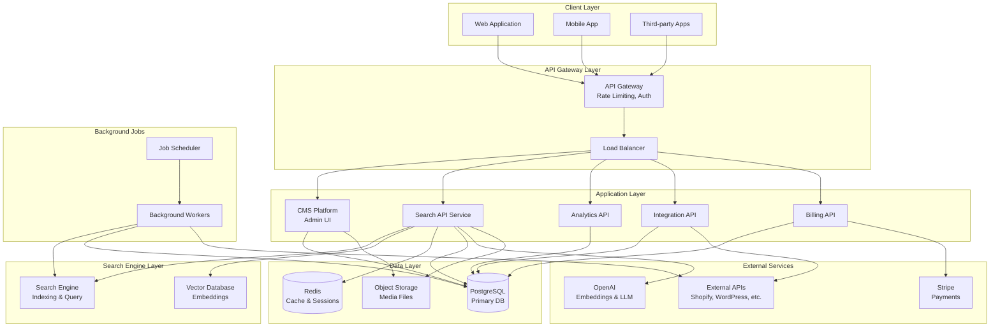

### 1.2. Основные компоненты

#### Frontend Layer
- **Admin Panel**: React 19 + Server Components
- **User Dashboard**: Next.js 15 с App Router
- **API Documentation**: Интерактивная документация
- **Widget Library**: Встраиваемые компоненты поиска

#### Backend Layer
- **CMS Platform**: Headless CMS для управления контентом
- **Search Service**: Основной сервис поиска
- **Analytics Service**: Сбор и анализ данных
- **Integration Service**: Синхронизация с внешними системами
- **Billing Service**: Управление подписками и платежами

#### Data Layer
- **PostgreSQL 15+**: Основная реляционная БД
- **Redis 7+**: Кэш и очереди
- **Search Engine**: Поисковый движок с поддержкой векторного поиска
- **Object Storage**: S3-совместимое хранилище для медиа

### 1.3. Технологический стек

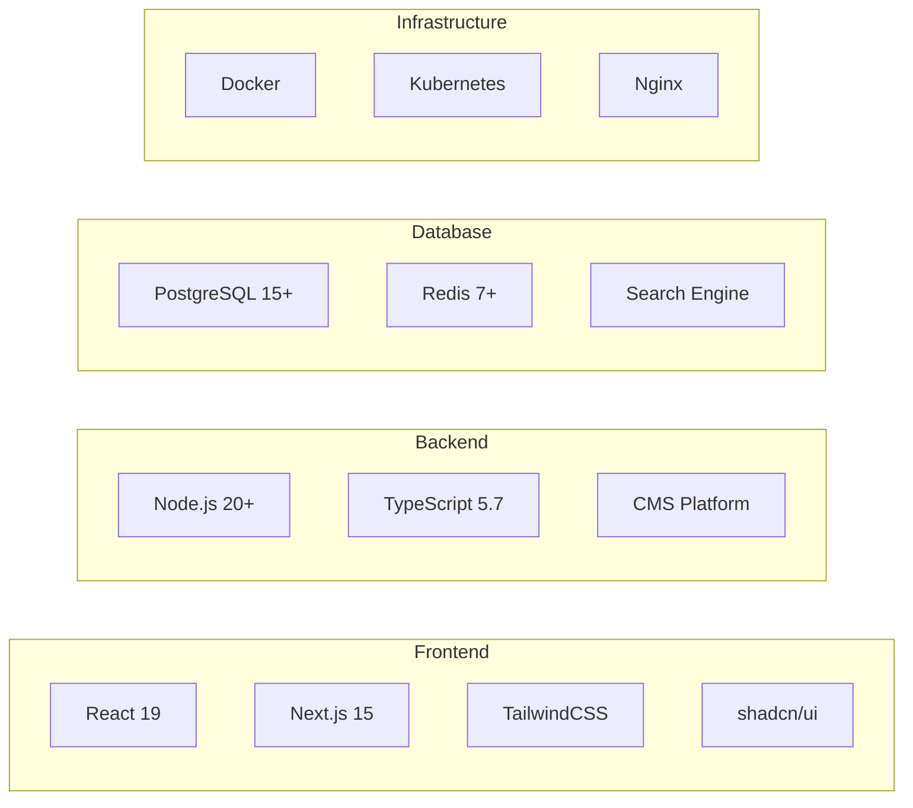

---

## 2. Микросервисная архитектура

### 2.1. API Gateway

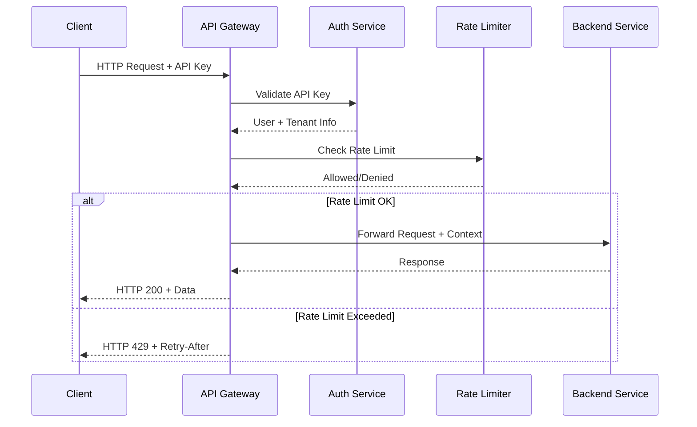

**Функции API Gateway:**
- Аутентификация и авторизация
- Rate limiting и throttling
- Request/Response трансформация
- Логирование и мониторинг
- API версионирование
- CORS handling

**Реализация:**

```typescript
// src/middleware/apiGateway.ts
export async function apiGatewayMiddleware(req: Request): Promise<Response | null> {
  // 1. Extract API key
  const apiKey = req.headers.get('X-API-Key') ||
                 req.headers.get('Authorization')?.replace('Bearer ', '');

  if (!apiKey) {
    return Response.json({error: 'API key required'}, {status: 401});
  }

  // 2. Validate and get tenant
  const apiKeyRecord = await validateApiKey(apiKey);
  if (!apiKeyRecord) {
    return Response.json({error: 'Invalid API key'}, {status: 401});
  }

  const tenantId = apiKeyRecord.tenant;

  // 3. Check rate limit
  const rateLimit = await checkRateLimit(tenantId, 'api');
  if (!rateLimit.allowed) {
    return Response.json(
      {
        error: 'Rate limit exceeded',
        limit: rateLimit.limit,
        resetAt: rateLimit.resetAt
      },
      {
        status: 429,
        headers: {
          'X-RateLimit-Limit': String(rateLimit.limit),
          'X-RateLimit-Remaining': String(rateLimit.remaining),
          'X-RateLimit-Reset': String(rateLimit.resetAt),
          'Retry-After': String(rateLimit.retryAfter)
        }
      }
    );
  }

  // 4. Add context to request
  (req as any).context = {
    tenantId,
    apiKeyId: apiKeyRecord.id,
    scopes: apiKeyRecord.scopes
  };

  return null; // Continue to handler
}
```

### 2.2. Search Service

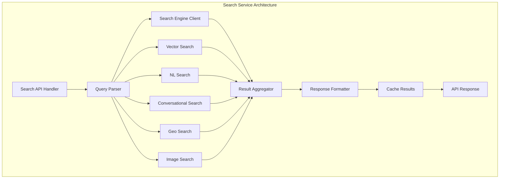

**Компоненты Search Service:**

1. **Query Parser**: Анализ и оптимизация запросов
2. **Search Engine Client**: Взаимодействие с поисковым движком
3. **Vector Search**: Семантический поиск
4. **NL Search**: Natural language processing
5. **Conversational Search**: RAG с LLM
6. **Geo Search**: Географический поиск
7. **Image Search**: CLIP-based поиск по изображениям

### 2.3. Analytics Service

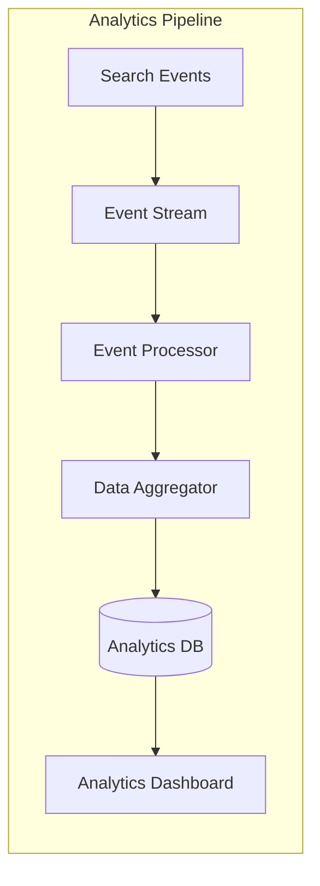

**Analytics Data Flow:**

```typescript
// Event tracking
interface SearchEvent {
  timestamp: Date;
  tenantId: string;
  query: string;
  collection: string;
  resultsFound: number;
  searchTimeMs: number;
  userId?: string;
  sessionId: string;
  filters?: Record<string, any>;
  sort?: string;
}

// Real-time aggregation
async function trackSearchEvent(event: SearchEvent): Promise<void> {
  // 1. Store raw event
  await redis.lpush(`events:${event.tenantId}:search`, JSON.stringify(event));

  // 2. Update real-time counters
  await redis.hincrby(`stats:${event.tenantId}:daily`, 'totalSearches', 1);
  await redis.zadd(`stats:${event.tenantId}:queries`, Date.now(), event.query);

  // 3. Check if no results
  if (event.resultsFound === 0) {
    await redis.hincrby(`stats:${event.tenantId}:daily`, 'noHitsCount', 1);
    await redis.zadd(`stats:${event.tenantId}:nohits`, Date.now(), event.query);
  }

  // 4. Track latency
  await redis.zadd(`stats:${event.tenantId}:latency`, event.searchTimeMs, Date.now());
}
```

### 2.4. Integration Service

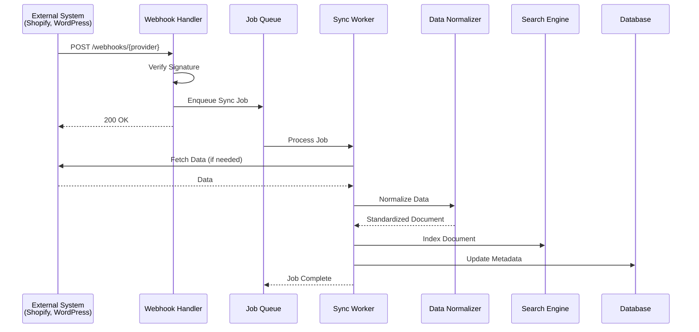

**Integration Patterns:**

1. **Webhook-based**: Real-time updates через вебхуки
2. **Polling-based**: Периодическая синхронизация
3. **Bulk Import**: Массовая загрузка данных
4. **Incremental Sync**: Синхронизация изменений

### 2.5. Billing Service

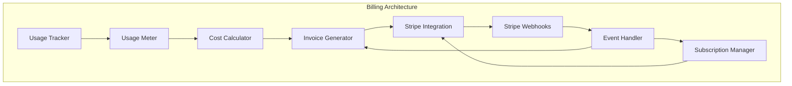

**Billing Flow:**

```typescript
// Usage tracking
async function trackUsage(
  tenantId: string,
  resource: 'searches' | 'documents' | 'api_calls',
  quantity: number
): Promise<void> {
  const period = getCurrentBillingPeriod();

  // Increment counter
  await payload.update({
    collection: 'usage_counters',
    where: {
      tenant: {equals: tenantId},
      period: {equals: period}
    },
    data: {
      [`counters.${resource}`]: {
        increment: quantity
      }
    }
  });

  // Check if limit exceeded
  const usage = await getUsage(tenantId, period);
  const plan = await getTenantPlan(tenantId);

  if (usage[resource] > plan.limits[resource]) {
    await notifyOverage(tenantId, resource);
  }
}

// Stripe webhook handling
async function handleStripeWebhook(event: Stripe.Event): Promise<void> {
  switch (event.type) {
    case 'checkout.session.completed':
      const session = event.data.object as Stripe.Checkout.Session;
      await activateSubscription(session.metadata.tenant_id, session.subscription);
      break;

    case 'invoice.payment_succeeded':
      const invoice = event.data.object as Stripe.Invoice;
      await recordPayment(invoice);
      break;

    case 'customer.subscription.updated':
      const subscription = event.data.object as Stripe.Subscription;
      await updateSubscription(subscription);
      break;

    case 'customer.subscription.deleted':
      const canceledSub = event.data.object as Stripe.Subscription;
      await cancelSubscription(canceledSub.metadata.tenant_id);
      break;
  }
}
```

---

## 3. Data Flow (Поток данных)

### 3.1. Indexing Pipeline

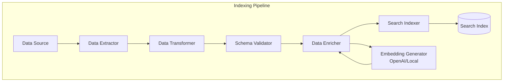

**Indexing Process:**

```typescript
// Document indexing pipeline
async function indexDocument(
  collection: string,
  document: Record<string, any>,
  tenantId: string
): Promise<void> {
  // 1. Extract fields
  const extracted = await extractFields(document, collection);

  // 2. Transform data
  const transformed = await transformData(extracted, {
    lowercase: true,
    stripHtml: true,
    normalizeWhitespace: true
  });

  // 3. Validate schema
  const validated = await validateSchema(transformed, collection);

  // 4. Enrich with metadata
  const enriched = {
    ...validated,
    tenant: tenantId,
    indexed_at: new Date().toISOString(),
    _meta: {
      source: 'api',
      version: 1
    }
  };

  // 5. Generate embeddings if needed
  if (hasEmbeddingField(collection)) {
    const embeddingFields = getEmbeddingFields(collection);
    for (const field of embeddingFields) {
      const text = extractTextForEmbedding(enriched, field.from);
      enriched[field.name] = await generateEmbedding(text, field.model);
    }
  }

  // 6. Index in search engine
  await searchEngine.collections(collection).documents().upsert(enriched);

  // 7. Store metadata in PostgreSQL
  await payload.update({
    collection: 'resource_mappings',
    where: {
      externalId: {equals: document.id},
      tenant: {equals: tenantId}
    },
    data: {
      lastSyncAt: new Date(),
      syncStatus: 'completed'
    }
  });
}
```

### 3.2. Search Query Flow

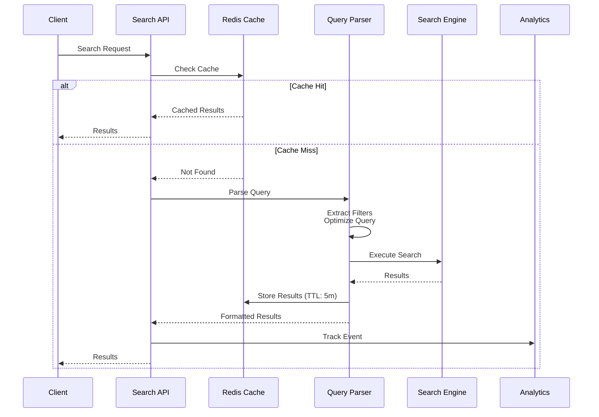

### 3.3. Real-time Updates

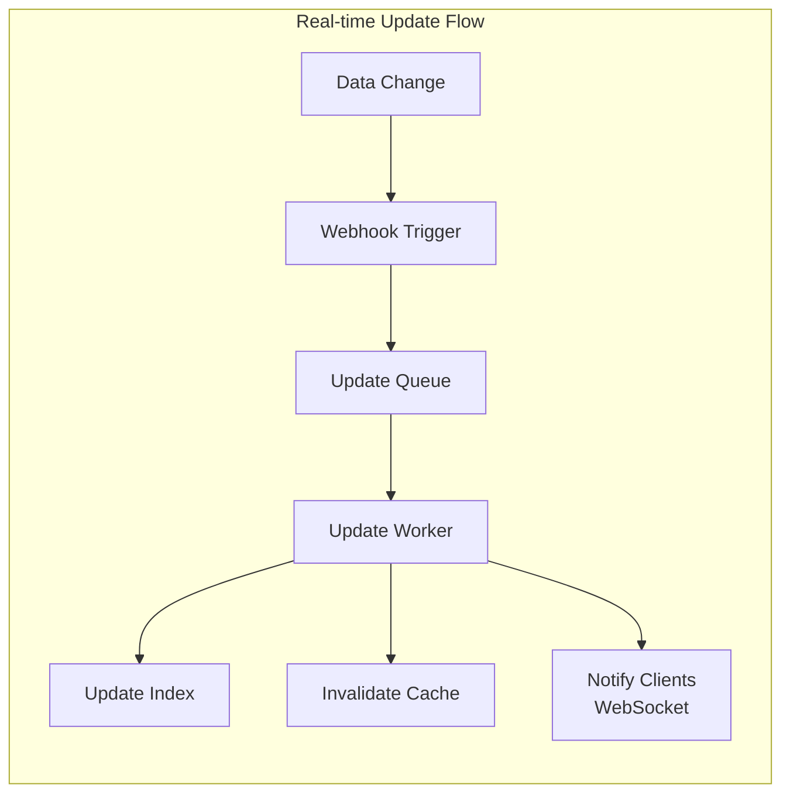

---

## 4. Multi-tenant изоляция

### 4.1. Логическая изоляция

```mermaid
graph TB
    subgraph "Multi-tenant Architecture"
        Request[Client Request]
        Gateway[API Gateway]
        TenantResolver[Tenant Resolver]
        AppLayer[Application Layer]
        DataLayer[Data Layer with RLS]

        Request --> Gateway
        Gateway --> TenantResolver
        TenantResolver --> AppLayer
        AppLayer --> DataLayer

        TenantResolver -.->|Set tenant_id| Context[Request Context]
        Context -.-> AppLayer
        Context -.-> DataLayer
    end

    subgraph "Data Isolation"
        Postgres[(PostgreSQL + RLS)]
        SearchIndex[Search Indexes<br/>Filtered by tenant]
        Cache[Redis Namespaces<br/>tenant:{id}:*]

        DataLayer --> Postgres
        DataLayer --> SearchIndex
        DataLayer --> Cache
    end
```

**Tenant Resolution:**

```typescript
// Tenant resolution от API ключа
async function resolveTenant(apiKey: string): Promise<string> {
  // 1. Validate API key
  const keyRecord = await payload.findOne({
    collection: 'api_keys',
    where: {
      keyHash: {equals: hashApiKey(apiKey)},
      isActive: {equals: true}
    }
  });

  if (!keyRecord) {
    throw new Error('Invalid API key');
  }

  // 2. Get tenant
  const tenant = await payload.findByID({
    collection: 'tenants',
    id: keyRecord.tenant as string
  });

  return tenant.id;
}

// Set tenant context для запроса
async function setTenantContext(req: Request, tenantId: string): Promise<void> {
  // PostgreSQL: Set session variable
  await db.query(`SET app.current_tenant = $1`, [tenantId]);

  // Request context
  (req as any).context = {
    ...((req as any).context || {}),
    tenantId
  };
}
```

### 4.2. Row-Level Security (RLS)

```sql
-- PostgreSQL Row-Level Security для tenant изоляции

-- Enable RLS на таблицах
ALTER TABLE documents ENABLE ROW LEVEL SECURITY;
ALTER TABLE collections ENABLE ROW LEVEL SECURITY;
ALTER TABLE api_keys ENABLE ROW LEVEL SECURITY;

-- Политика для чтения
CREATE POLICY tenant_isolation_select ON documents
  FOR SELECT
  TO authenticated
  USING (tenant_id = current_setting('app.current_tenant')::uuid);

-- Политика для вставки
CREATE POLICY tenant_isolation_insert ON documents
  FOR INSERT
  TO authenticated
  WITH CHECK (tenant_id = current_setting('app.current_tenant')::uuid);

-- Политика для обновления
CREATE POLICY tenant_isolation_update ON documents
  FOR UPDATE
  TO authenticated
  USING (tenant_id = current_setting('app.current_tenant')::uuid)
  WITH CHECK (tenant_id = current_setting('app.current_tenant')::uuid);

-- Политика для удаления
CREATE POLICY tenant_isolation_delete ON documents
  FOR DELETE
  TO authenticated
  USING (tenant_id = current_setting('app.current_tenant')::uuid);

-- Platform admin bypass (опционально)
CREATE POLICY platform_admin_bypass ON documents
  FOR ALL
  TO platform_admin
  USING (true);
```

### 4.3. Изоляция поисковых индексов

```typescript
// Tenant-specific индексы в поисковом движке
async function createTenantCollection(
  tenantId: string,
  collectionName: string,
  schema: CollectionSchema
): Promise<void> {
  // Префикс для изоляции
  const fullCollectionName = `${tenantId}_${collectionName}`;

  // Создание коллекции
  await searchEngine.collections().create({
    name: fullCollectionName,
    fields: [
      {name: 'tenant', type: 'string', facet: true, index: true},
      ...schema.fields
    ],
    default_sorting_field: schema.defaultSortField
  });

  // Все запросы автоматически фильтруются по tenant
}

// Automatic tenant filtering
async function search(
  tenantId: string,
  collection: string,
  params: SearchParams
): Promise<SearchResults> {
  // Добавляем tenant filter ко всем запросам
  const enhancedParams = {
    ...params,
    filter_by: params.filter_by
      ? `tenant:=${tenantId} && ${params.filter_by}`
      : `tenant:=${tenantId}`
  };

  return await searchEngine
    .collections(collection)
    .documents()
    .search(enhancedParams);
}
```

---

## 5. База данных (PostgreSQL)

### 5.1. Схема базы данных

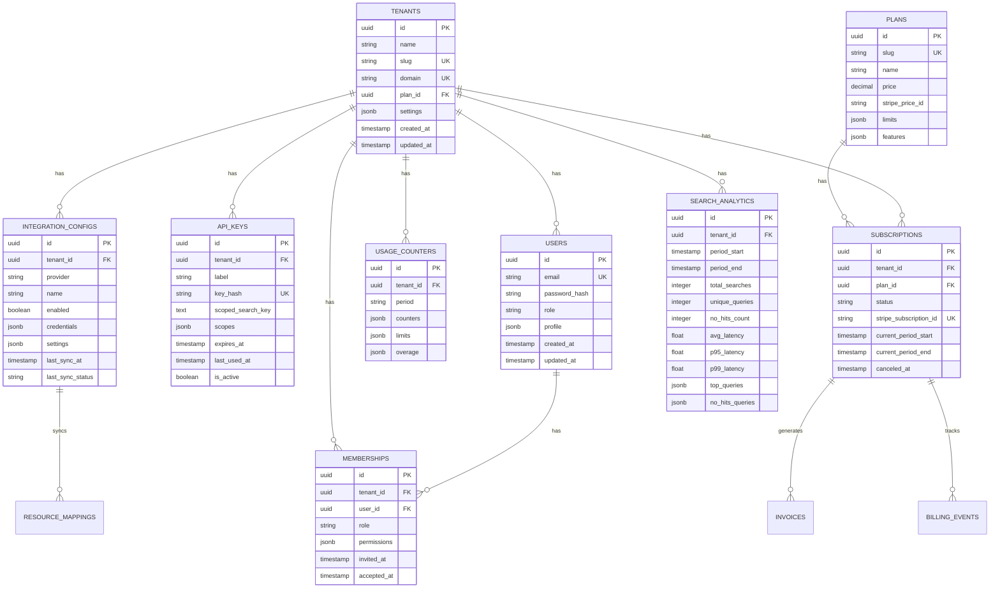

### 5.2. Индексы и оптимизация

```sql
-- Основные индексы для производительности

-- Tenants
CREATE INDEX idx_tenants_slug ON tenants(slug);
CREATE INDEX idx_tenants_domain ON tenants(domain);

-- Users
CREATE INDEX idx_users_email ON users(email);
CREATE INDEX idx_users_role ON users(role);

-- Memberships
CREATE INDEX idx_memberships_tenant ON memberships(tenant_id);
CREATE INDEX idx_memberships_user ON memberships(user_id);
CREATE INDEX idx_memberships_tenant_user ON memberships(tenant_id, user_id);

-- API Keys
CREATE INDEX idx_api_keys_tenant ON api_keys(tenant_id);
CREATE INDEX idx_api_keys_tenant_active ON api_keys(tenant_id, is_active) WHERE is_active = true;
CREATE INDEX idx_api_keys_hash ON api_keys(key_hash);

-- Subscriptions
CREATE INDEX idx_subscriptions_tenant ON subscriptions(tenant_id);
CREATE INDEX idx_subscriptions_status ON subscriptions(status);
CREATE INDEX idx_subscriptions_stripe_id ON subscriptions(stripe_subscription_id);

-- Usage Counters
CREATE INDEX idx_usage_counters_tenant_period ON usage_counters(tenant_id, period);

-- Integration Configs
CREATE INDEX idx_integration_configs_tenant ON integration_configs(tenant_id);
CREATE INDEX idx_integration_configs_provider ON integration_configs(provider);
CREATE INDEX idx_integration_configs_enabled ON integration_configs(enabled) WHERE enabled = true;

-- Search Analytics
CREATE INDEX idx_search_analytics_tenant_period ON search_analytics(tenant_id, period_start, period_end);
CREATE INDEX idx_search_analytics_period ON search_analytics(period_start, period_end);

-- Partial indexes для активных записей
CREATE INDEX idx_active_subscriptions ON subscriptions(tenant_id, status)
  WHERE status IN ('active', 'trialing');

-- GIN indexes для JSONB поиска
CREATE INDEX idx_tenants_settings ON tenants USING GIN(settings);
CREATE INDEX idx_api_keys_scopes ON api_keys USING GIN(scopes);
CREATE INDEX idx_integration_configs_settings ON integration_configs USING GIN(settings);

-- Covering indexes для частых запросов
CREATE INDEX idx_api_keys_covering ON api_keys(tenant_id, is_active)
  INCLUDE (label, scopes, expires_at);
```

### 5.3. Партиционирование

```sql
-- Партиционирование для больших таблиц (аналитика)

-- Создание партиционированной таблицы
CREATE TABLE search_analytics_partitioned (
    id uuid DEFAULT gen_random_uuid(),
    tenant_id uuid NOT NULL,
    period_start timestamp NOT NULL,
    period_end timestamp NOT NULL,
    total_searches integer NOT NULL DEFAULT 0,
    -- ... остальные поля
    PRIMARY KEY (id, period_start)
) PARTITION BY RANGE (period_start);

-- Создание партиций по месяцам
CREATE TABLE search_analytics_2024_01 PARTITION OF search_analytics_partitioned
    FOR VALUES FROM ('2024-01-01') TO ('2024-02-01');

CREATE TABLE search_analytics_2024_02 PARTITION OF search_analytics_partitioned
    FOR VALUES FROM ('2024-02-01') TO ('2024-03-01');

-- Автоматическое создание партиций
CREATE OR REPLACE FUNCTION create_monthly_partition()
RETURNS void AS $$
DECLARE
    partition_date date;
    partition_name text;
    start_date text;
    end_date text;
BEGIN
    partition_date := date_trunc('month', CURRENT_DATE + interval '1 month');
    partition_name := 'search_analytics_' || to_char(partition_date, 'YYYY_MM');
    start_date := partition_date::text;
    end_date := (partition_date + interval '1 month')::text;

    EXECUTE format(
        'CREATE TABLE IF NOT EXISTS %I PARTITION OF search_analytics_partitioned FOR VALUES FROM (%L) TO (%L)',
        partition_name,
        start_date,
        end_date
    );
END;
$$ LANGUAGE plpgsql;

-- Cron job для автоматического создания партиций
SELECT cron.schedule('create-partitions', '0 0 1 * *', 'SELECT create_monthly_partition()');
```

---

## 6. Поисковый движок

### 6.1. Архитектура индексов

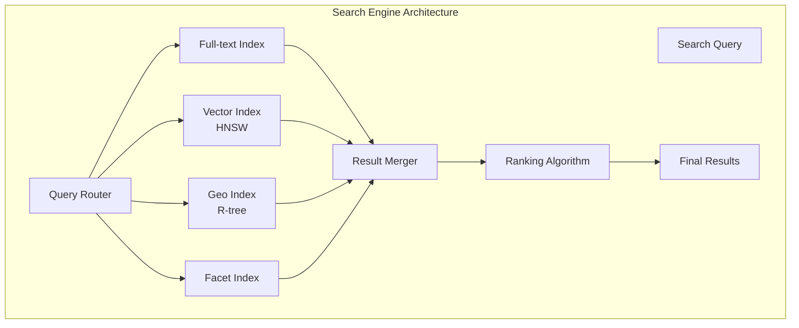

**Index Structure:**

```typescript
// Collection schema с различными типами индексов
interface CollectionSchema {
  name: string;
  fields: Array<{
    name: string;
    type: 'string' | 'int32' | 'float' | 'bool' | 'string[]' | 'float[]' | 'geopoint';
    index?: boolean;      // Индексировать ли поле
    facet?: boolean;      // Использовать для фасетов
    optional?: boolean;   // Опциональное поле
    sort?: boolean;       // Использовать для сортировки
    infix?: boolean;      // Инфиксный поиск
    stem?: boolean;       // Стемминг
    embed?: {             // Автоматические embeddings
      from: string[];
      model_config: {
        model_name: string;
      };
    };
  }>;
  default_sorting_field?: string;
  token_separators?: string[];
  symbols_to_index?: string[];
}

// Пример схемы products
const productsSchema: CollectionSchema = {
  name: 'products',
  fields: [
    {name: 'title', type: 'string', index: true, infix: true, stem: true},
    {name: 'description', type: 'string', index: true, stem: true},
    {name: 'sku', type: 'string', index: true, facet: true},
    {name: 'price', type: 'float', facet: true, sort: true},
    {name: 'category', type: 'string[]', facet: true},
    {name: 'brand', type: 'string', facet: true},
    {name: 'stock', type: 'int32', sort: true},
    {name: 'rating', type: 'float', sort: true},
    {name: 'location', type: 'geopoint'},
    {
      name: 'embedding',
      type: 'float[]',
      embed: {
        from: ['title', 'description'],
        model_config: {
          model_name: 'ts/all-MiniLM-L12-v2'
        }
      }
    }
  ],
  default_sorting_field: 'popularity',
  token_separators: ['-', '_'],
  symbols_to_index: ['#', '@']
};
```

### 6.2. Sharding и репликация

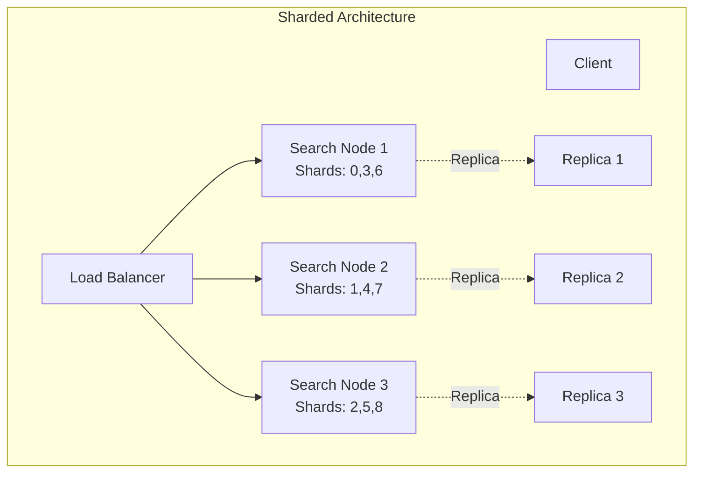

**Sharding Configuration:**

```typescript
// Конфигурация sharding
const shardingConfig = {
  num_shards: 9,           // Количество шардов
  num_replicas: 2,         // Количество реплик
  sharding_key: 'tenant',  // Ключ для шarding
  replication_factor: 3    // Фактор репликации
};

// Автоматическое распределение документов по шардам
function getShardForDocument(tenantId: string, numShards: number): number {
  // Consistent hashing
  const hash = crypto.createHash('md5').update(tenantId).digest('hex');
  const hashValue = parseInt(hash.substring(0, 8), 16);
  return hashValue % numShards;
}
```

### 6.3. Query Processing

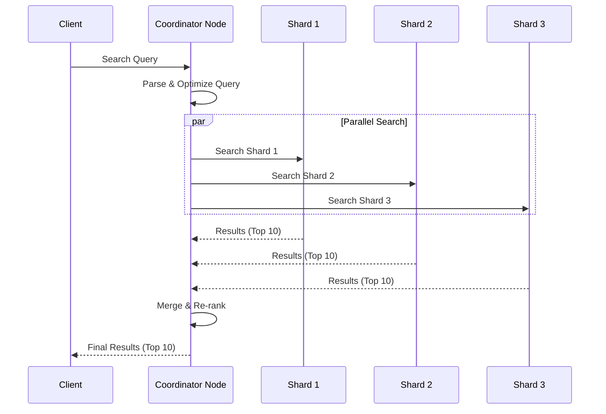

---

## 7. Кэширование (Redis)

### 7.1. Стратегии кэширования

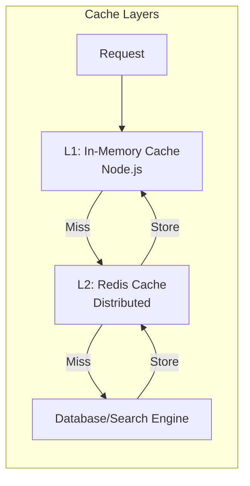

**Cache Strategies:**

```typescript
// Cache-Aside Pattern
async function getCachedSearchResults(
  cacheKey: string,
  searchFn: () => Promise<SearchResults>
): Promise<SearchResults> {
  // 1. Try L1 cache (in-memory)
  let results = inMemoryCache.get(cacheKey);
  if (results) {
    return results;
  }

  // 2. Try L2 cache (Redis)
  const cached = await redis.get(cacheKey);
  if (cached) {
    results = JSON.parse(cached);
    // Store in L1
    inMemoryCache.set(cacheKey, results, {ttl: 60}); // 1 min
    return results;
  }

  // 3. Query database/search engine
  results = await searchFn();

  // 4. Store in both caches
  await redis.setex(cacheKey, 300, JSON.stringify(results)); // 5 min
  inMemoryCache.set(cacheKey, results, {ttl: 60});

  return results;
}

// Write-Through Pattern (для обновлений)
async function updateDocument(
  collection: string,
  documentId: string,
  data: any
): Promise<void> {
  // 1. Update database
  await searchEngine.collections(collection).documents(documentId).update(data);

  // 2. Update cache
  const cacheKey = `doc:${collection}:${documentId}`;
  await redis.set(cacheKey, JSON.stringify(data), {ex: 3600});

  // 3. Invalidate related caches
  await invalidateSearchCache(collection);
}
```

### 7.2. Cache Invalidation

```typescript
// Стратегии инвалидации кэша

// 1. Time-based (TTL)
await redis.setex('key', 300, 'value'); // 5 minutes

// 2. Event-based
async function onDocumentChange(collection: string, documentId: string): Promise<void> {
  // Invalidate document cache
  await redis.del(`doc:${collection}:${documentId}`);

  // Invalidate search results cache для этой коллекции
  const pattern = `search:${collection}:*`;
  const keys = await redis.keys(pattern);
  if (keys.length > 0) {
    await redis.del(...keys);
  }

  // Invalidate aggregations
  await redis.del(`facets:${collection}`);
}

// 3. Tag-based invalidation
async function tagBasedInvalidation(tags: string[]): Promise<void> {
  for (const tag of tags) {
    const keys = await redis.smembers(`tag:${tag}`);
    if (keys.length > 0) {
      await redis.del(...keys);
      await redis.del(`tag:${tag}`);
    }
  }
}

// Использование тегов
async function setCachedWithTags(
  key: string,
  value: any,
  tags: string[],
  ttl: number
): Promise<void> {
  await redis.setex(key, ttl, JSON.stringify(value));

  // Связываем ключ с тегами
  for (const tag of tags) {
    await redis.sadd(`tag:${tag}`, key);
  }
}
```

### 7.3. Distributed Caching

```typescript
// Redis Cluster для distributed caching
import {Cluster} from 'ioredis';

const redisCluster = new Cluster([
  {host: 'redis-1', port: 6379},
  {host: 'redis-2', port: 6379},
  {host: 'redis-3', port: 6379}
], {
  redisOptions: {
    password: process.env.REDIS_PASSWORD
  },
  clusterRetryStrategy: (times) => Math.min(100 * times, 2000)
});

// Cache namespacing для multi-tenancy
function getTenantCacheKey(tenantId: string, key: string): string {
  return `tenant:${tenantId}:${key}`;
}

// Batch operations для производительности
async function batchGetCache(keys: string[]): Promise<Map<string, any>> {
  const pipeline = redis.pipeline();
  keys.forEach(key => pipeline.get(key));

  const results = await pipeline.exec();
  const map = new Map();

  results?.forEach((result, index) => {
    if (result[1]) {
      map.set(keys[index], JSON.parse(result[1] as string));
    }
  });

  return map;
}
```

---

## 8. Job Scheduler (Планировщик задач)

### 8.1. Архитектура Job Queue

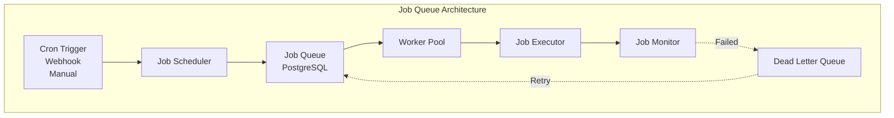

### 8.2. Job Types и расписания

**10 основных Jobs:**

```typescript
// Job Registry
const jobs = [
  {
    slug: 'snapshot-daily',
    cron: '0 1 * * *',        // 01:00 daily
    queue: 'nightly',
    description: 'Daily snapshots of collections'
  },
  {
    slug: 'reindex-nightly',
    cron: '0 2 * * *',        // 02:00 daily
    queue: 'nightly',
    description: 'Full reindex of all collections'
  },
  {
    slug: 'analytics-aggregation',
    cron: '0 2 * * *',        // 02:00 daily
    queue: 'nightly',
    description: 'Aggregate search analytics'
  },
  {
    slug: 'dictionary-update-weekly',
    cron: '0 3 * * 0',        // 03:00 on Sundays
    queue: 'weekly',
    description: 'Generate synonym candidates'
  },
  {
    slug: 'webhook-retry',
    cron: '*/15 * * * *',     // Every 15 minutes
    queue: 'frequent',
    description: 'Retry failed webhooks'
  },
  {
    slug: 'data-sanitation-weekly',
    cron: '0 4 * * 0',        // 04:00 on Sundays
    queue: 'weekly',
    description: 'Clean up stale data'
  },
  {
    slug: 'gdpr-cleanup-daily',
    cron: '0 5 * * *',        // 05:00 daily
    queue: 'nightly',
    description: 'GDPR compliance cleanup'
  },
  {
    slug: 'key-rotation-monthly',
    cron: '0 0 1 * *',        // 1st of month at 00:00
    queue: 'monthly',
    description: 'Rotate API keys'
  },
  {
    slug: 'ecommerce-sync',
    cron: '*/5 * * * *',      // Every 5 minutes
    queue: 'frequent',
    description: 'Sync e-commerce data'
  },
  {
    slug: 'integration-sync',
    cron: '*/15 * * * *',     // Every 15 minutes
    queue: 'frequent',
    description: 'Sync external integrations'
  }
];
```

### 8.3. Error Handling и Retry Logic

```typescript
// Job execution с retry logic
interface JobExecution {
  jobId: string;
  attempt: number;
  maxRetries: number;
  status: 'pending' | 'running' | 'completed' | 'failed';
  error?: string;
  startedAt?: Date;
  completedAt?: Date;
}

async function executeJobWithRetry(
  jobSlug: string,
  input: any,
  maxRetries: number = 3
): Promise<any> {
  let attempt = 0;
  let lastError: Error | null = null;

  while (attempt < maxRetries) {
    try {
      attempt++;

      // Log attempt
      await payload.create({
        collection: 'job_executions',
        data: {
          jobSlug,
          attempt,
          status: 'running',
          startedAt: new Date()
        }
      });

      // Execute job
      const result = await executeJob(jobSlug, input);

      // Log success
      await payload.update({
        collection: 'job_executions',
        where: {jobSlug: {equals: jobSlug}},
        data: {
          status: 'completed',
          completedAt: new Date(),
          output: result
        }
      });

      return result;

    } catch (error) {
      lastError = error as Error;

      // Log error
      await payload.update({
        collection: 'job_executions',
        where: {jobSlug: {equals: jobSlug}},
        data: {
          status: 'failed',
          error: lastError.message,
          completedAt: new Date()
        }
      });

      // Exponential backoff
      if (attempt < maxRetries) {
        const delay = Math.min(1000 * Math.pow(2, attempt), 30000);
        await new Promise(resolve => setTimeout(resolve, delay));
      }
    }
  }

  // All retries exhausted
  await payload.create({
    collection: 'job_dlq',
    data: {
      jobSlug,
      input,
      error: lastError?.message,
      attempts: maxRetries,
      failedAt: new Date()
    }
  });

  throw lastError;
}
```

---

## 9. Webhook система

### 9.1. Webhook Processing

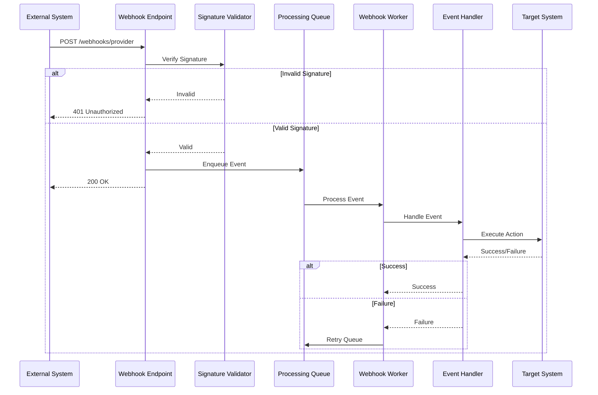

### 9.2. Dead Letter Queue (DLQ)

```typescript
// Webhook retry с DLQ
interface WebhookEvent {
  id: string;
  provider: string;
  event: string;
  payload: any;
  attempts: number;
  lastAttemptAt?: Date;
  nextRetryAt?: Date;
}

async function processWebhook(event: WebhookEvent): Promise<void> {
  const maxAttempts = 5;
  const backoffMultiplier = 2;

  try {
    // Process webhook
    await handleWebhookEvent(event.provider, event.event, event.payload);

    // Mark as processed
    await payload.update({
      collection: 'webhook_events',
      id: event.id,
      data: {
        status: 'processed',
        processedAt: new Date()
      }
    });

  } catch (error) {
    const nextAttempt = event.attempts + 1;

    if (nextAttempt >= maxAttempts) {
      // Move to DLQ
      await payload.create({
        collection: 'webhook_dlq',
        data: {
          provider: event.provider,
          event: event.event,
          payload: event.payload,
          attempts: nextAttempt,
          error: (error as Error).message,
          failedAt: new Date()
        }
      });

      // Mark original event as failed
      await payload.update({
        collection: 'webhook_events',
        id: event.id,
        data: {status: 'failed'}
      });

    } else {
      // Calculate next retry time (exponential backoff)
      const delay = Math.min(
        1000 * Math.pow(backoffMultiplier, nextAttempt),
        3600000 // Max 1 hour
      );
      const nextRetryAt = new Date(Date.now() + delay);

      // Schedule retry
      await payload.update({
        collection: 'webhook_events',
        id: event.id,
        data: {
          attempts: nextAttempt,
          lastAttemptAt: new Date(),
          nextRetryAt,
          lastError: (error as Error).message
        }
      });
    }
  }
}

// Job для повторной обработки из DLQ
async function retryDLQEvents(): Promise<void> {
  const dlqEvents = await payload.find({
    collection: 'webhook_dlq',
    where: {
      retried: {not_equals: true},
      failedAt: {
        greater_than: new Date(Date.now() - 24 * 60 * 60 * 1000) // Last 24h
      }
    },
    limit: 100
  });

  for (const event of dlqEvents.docs) {
    try {
      await handleWebhookEvent(event.provider, event.event, event.payload);

      // Mark as retried successfully
      await payload.update({
        collection: 'webhook_dlq',
        id: event.id,
        data: {
          retried: true,
          retriedAt: new Date(),
          retriedSuccessfully: true
        }
      });
    } catch (error) {
      // Log retry failure
      await payload.update({
        collection: 'webhook_dlq',
        id: event.id,
        data: {
          retried: true,
          retriedAt: new Date(),
          retriedSuccessfully: false,
          retryError: (error as Error).message
        }
      });
    }
  }
}
```

### 9.3. Webhook Security

```typescript
// Webhook signature verification
function verifyWebhookSignature(
  provider: string,
  payload: string,
  signature: string,
  secret: string
): boolean {
  switch (provider) {
    case 'shopify':
      const hmac = crypto
        .createHmac('sha256', secret)
        .update(payload)
        .digest('base64');
      return hmac === signature;

    case 'stripe':
      const stripe = new Stripe(process.env.STRIPE_SECRET_KEY!);
      try {
        stripe.webhooks.constructEvent(payload, signature, secret);
        return true;
      } catch {
        return false;
      }

    case 'custom':
      const hash = crypto
        .createHmac('sha256', secret)
        .update(payload)
        .digest('hex');
      return hash === signature;

    default:
      return false;
  }
}

// Webhook endpoint с валидацией
app.post('/webhooks/:provider', async (req, res) => {
  const {provider} = req.params;
  const signature = req.headers['x-webhook-signature'] as string;
  const rawBody = req.rawBody; // Нужен raw body для verification

  // Получить webhook secret для провайдера
  const config = await getIntegrationConfig(provider);
  if (!config) {
    return res.status(404).json({error: 'Provider not found'});
  }

  // Verify signature
  const isValid = verifyWebhookSignature(
    provider,
    rawBody,
    signature,
    config.webhookSecret
  );

  if (!isValid) {
    return res.status(401).json({error: 'Invalid signature'});
  }

  // Enqueue webhook для async processing
  await payload.create({
    collection: 'webhook_events',
    data: {
      provider,
      event: req.body.event || req.body.type,
      payload: req.body,
      receivedAt: new Date(),
      status: 'pending'
    }
  });

  // Return 200 immediately
  res.status(200).json({received: true});
});
```

---

## 10. Масштабирование

### 10.1. Horizontal Scaling

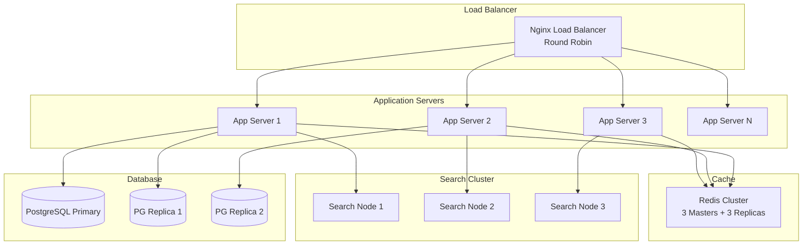

### 10.2. Load Balancing

```nginx
# Nginx configuration для load balancing

upstream app_servers {
    least_conn;  # Least connections algorithm

    server app1.aacsearch.local:3000 weight=3 max_fails=3 fail_timeout=30s;
    server app2.aacsearch.local:3000 weight=3 max_fails=3 fail_timeout=30s;
    server app3.aacsearch.local:3000 weight=2 max_fails=3 fail_timeout=30s;

    # Health check
    check interval=3000 rise=2 fall=3 timeout=1000 type=http;
    check_http_send "GET /api/health HTTP/1.0\r\n\r\n";
    check_http_expect_alive http_2xx;
}

upstream search_servers {
    hash $request_uri consistent;  # Consistent hashing для кэширования

    server search1.aacsearch.local:8108;
    server search2.aacsearch.local:8108;
    server search3.aacsearch.local:8108;
}

server {
    listen 443 ssl http2;
    server_name api.aacsearch.com;

    ssl_certificate /etc/nginx/ssl/cert.pem;
    ssl_certificate_key /etc/nginx/ssl/key.pem;

    # Rate limiting
    limit_req_zone $binary_remote_addr zone=api_limit:10m rate=100r/s;
    limit_req zone=api_limit burst=200 nodelay;

    # API endpoints
    location /api/ {
        proxy_pass http://app_servers;
        proxy_http_version 1.1;
        proxy_set_header Upgrade $http_upgrade;
        proxy_set_header Connection 'upgrade';
        proxy_set_header Host $host;
        proxy_set_header X-Real-IP $remote_addr;
        proxy_set_header X-Forwarded-For $proxy_add_x_forwarded_for;
        proxy_set_header X-Forwarded-Proto $scheme;

        # Timeouts
        proxy_connect_timeout 60s;
        proxy_send_timeout 60s;
        proxy_read_timeout 60s;

        # Buffering
        proxy_buffering on;
        proxy_buffer_size 4k;
        proxy_buffers 8 4k;
        proxy_busy_buffers_size 8k;
    }

    # Search endpoints - direct to search cluster
    location /search/ {
        proxy_pass http://search_servers;
        proxy_http_version 1.1;
        proxy_set_header Host $host;
    }
}
```

### 10.3. Auto-scaling стратегии

```yaml
# Kubernetes HorizontalPodAutoscaler
apiVersion: autoscaling/v2
kind: HorizontalPodAutoscaler
metadata:
  name: aacsearch-app-hpa
spec:
  scaleTargetRef:
    apiVersion: apps/v1
    kind: Deployment
    name: aacsearch-app
  minReplicas: 3
  maxReplicas: 20
  metrics:
  - type: Resource
    resource:
      name: cpu
      target:
        type: Utilization
        averageUtilization: 70
  - type: Resource
    resource:
      name: memory
      target:
        type: Utilization
        averageUtilization: 80
  - type: Pods
    pods:
      metric:
        name: http_requests_per_second
      target:
        type: AverageValue
        averageValue: "1000"
  behavior:
    scaleDown:
      stabilizationWindowSeconds: 300  # 5 минут перед scale down
      policies:
      - type: Percent
        value: 50  # Max 50% pods за раз
        periodSeconds: 60
    scaleUp:
      stabilizationWindowSeconds: 60
      policies:
      - type: Percent
        value: 100  # Можем удвоить количество pods
        periodSeconds: 60
      - type: Pods
        value: 4    # Или добавить 4 pods
        periodSeconds: 60
      selectPolicy: Max  # Выбрать максимальное значение
```

**Custom Metrics для Auto-scaling:**

```typescript
// Экспорт метрик для Prometheus
import {register, Counter, Histogram} from 'prom-client';

// HTTP requests counter
const httpRequestsTotal = new Counter({
  name: 'http_requests_total',
  help: 'Total number of HTTP requests',
  labelNames: ['method', 'path', 'status']
});

// Request duration histogram
const httpRequestDuration = new Histogram({
  name: 'http_request_duration_seconds',
  help: 'Duration of HTTP requests in seconds',
  labelNames: ['method', 'path'],
  buckets: [0.005, 0.01, 0.025, 0.05, 0.1, 0.25, 0.5, 1, 2.5, 5, 10]
});

// Search requests per second
const searchRequestsPerSecond = new Counter({
  name: 'search_requests_per_second',
  help: 'Number of search requests per second'
});

// Middleware для сбора метрик
app.use((req, res, next) => {
  const start = Date.now();

  res.on('finish', () => {
    const duration = (Date.now() - start) / 1000;

    httpRequestsTotal.inc({
      method: req.method,
      path: req.path,
      status: res.statusCode
    });

    httpRequestDuration.observe({
      method: req.method,
      path: req.path
    }, duration);

    if (req.path.startsWith('/api/search')) {
      searchRequestsPerSecond.inc();
    }
  });

  next();
});

// Metrics endpoint для Prometheus
app.get('/metrics', async (req, res) => {
  res.set('Content-Type', register.contentType);
  res.end(await register.metrics());
});
```

---

## 11. Безопасность

### 11.1. Authentication Flow

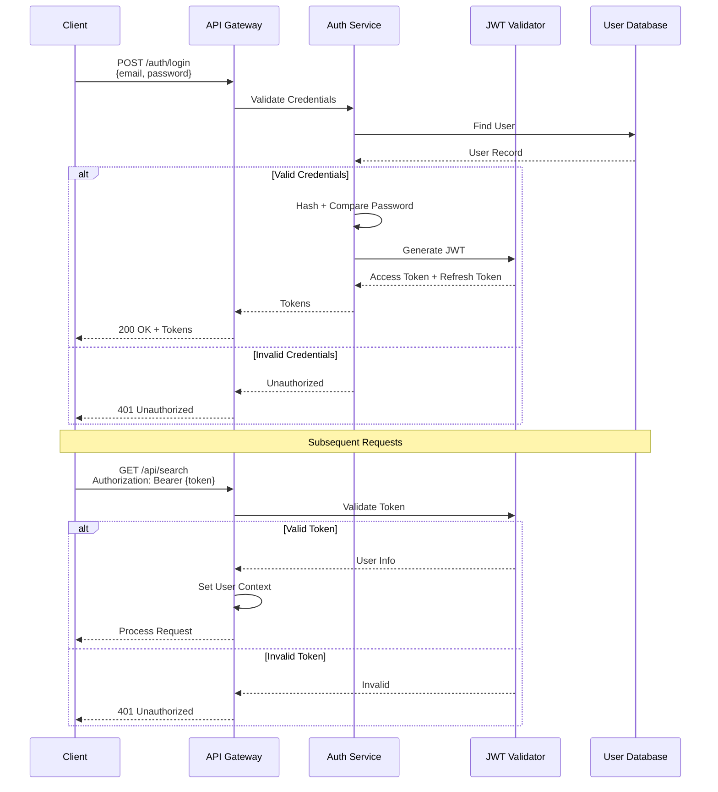

### 11.2. Authorization (RBAC)

```typescript
// Role-based Access Control
enum Role {
  PLATFORM_ADMIN = 'platform:admin',
  TENANT_ADMIN = 'admin',
  TENANT_EDITOR = 'editor',
  TENANT_VIEWER = 'viewer'
}

enum Permission {
  // Tenant management
  MANAGE_TENANT = 'manage:tenant',
  VIEW_TENANT = 'view:tenant',

  // User management
  MANAGE_USERS = 'manage:users',
  INVITE_USERS = 'invite:users',
  VIEW_USERS = 'view:users',

  // Collections
  MANAGE_COLLECTIONS = 'manage:collections',
  EDIT_DOCUMENTS = 'edit:documents',
  VIEW_DOCUMENTS = 'view:documents',

  // Search
  SEARCH = 'search',
  ADVANCED_SEARCH = 'search:advanced',

  // Analytics
  VIEW_ANALYTICS = 'view:analytics',
  EXPORT_ANALYTICS = 'export:analytics',

  // API Keys
  MANAGE_API_KEYS = 'manage:api_keys',
  VIEW_API_KEYS = 'view:api_keys',

  // Billing
  MANAGE_BILLING = 'manage:billing',
  VIEW_BILLING = 'view:billing'
}

// Permission mapping
const rolePermissions: Record<Role, Permission[]> = {
  [Role.PLATFORM_ADMIN]: [
    // All permissions
    ...Object.values(Permission)
  ],
  [Role.TENANT_ADMIN]: [
    Permission.MANAGE_TENANT,
    Permission.VIEW_TENANT,
    Permission.MANAGE_USERS,
    Permission.INVITE_USERS,
    Permission.VIEW_USERS,
    Permission.MANAGE_COLLECTIONS,
    Permission.EDIT_DOCUMENTS,
    Permission.VIEW_DOCUMENTS,
    Permission.SEARCH,
    Permission.ADVANCED_SEARCH,
    Permission.VIEW_ANALYTICS,
    Permission.EXPORT_ANALYTICS,
    Permission.MANAGE_API_KEYS,
    Permission.VIEW_API_KEYS,
    Permission.MANAGE_BILLING,
    Permission.VIEW_BILLING
  ],
  [Role.TENANT_EDITOR]: [
    Permission.VIEW_TENANT,
    Permission.VIEW_USERS,
    Permission.EDIT_DOCUMENTS,
    Permission.VIEW_DOCUMENTS,
    Permission.SEARCH,
    Permission.VIEW_ANALYTICS
  ],
  [Role.TENANT_VIEWER]: [
    Permission.VIEW_TENANT,
    Permission.VIEW_DOCUMENTS,
    Permission.SEARCH
  ]
};

// Authorization middleware
function requirePermission(permission: Permission) {
  return async (req: Request, res: Response, next: NextFunction) => {
    const user = req.user;
    if (!user) {
      return res.status(401).json({error: 'Unauthorized'});
    }

    const userRole = user.role as Role;
    const permissions = rolePermissions[userRole] || [];

    if (!permissions.includes(permission)) {
      return res.status(403).json({
        error: 'Forbidden',
        message: `Permission ${permission} required`
      });
    }

    next();
  };
}

// Usage
app.get('/api/analytics',
  authenticateJWT,
  requirePermission(Permission.VIEW_ANALYTICS),
  analyticsHandler
);
```

### 11.3. API Security

```typescript
// API Key Security

// 1. API Key Generation
function generateApiKey(): {key: string; hash: string} {
  const key = `aac_${crypto.randomBytes(32).toString('hex')}`;
  const hash = crypto
    .createHash('sha256')
    .update(key)
    .digest('hex');

  return {key, hash};
}

// 2. Rate Limiting per API Key
async function checkApiKeyRateLimit(
  apiKeyId: string,
  limit: number,
  window: number
): Promise<{allowed: boolean; remaining: number}> {
  const key = `ratelimit:apikey:${apiKeyId}`;
  const now = Date.now();
  const windowStart = now - window;

  // Remove old entries
  await redis.zremrangebyscore(key, 0, windowStart);

  // Count requests in window
  const count = await redis.zcount(key, windowStart, now);

  if (count >= limit) {
    return {allowed: false, remaining: 0};
  }

  // Add current request
  await redis.zadd(key, now, `${now}-${crypto.randomBytes(8).toString('hex')}`);
  await redis.expire(key, Math.ceil(window / 1000));

  return {allowed: true, remaining: limit - count - 1};
}

// 3. Scoped API Keys (Row-level security)
interface ScopedKeyParams {
  parentKey: string;
  filters: Record<string, any>;
  expiresIn: number; // seconds
}

async function generateScopedKey(params: ScopedKeyParams): Promise<string> {
  const {parentKey, filters, expiresIn} = params;

  // Validate parent key
  const parentKeyRecord = await validateApiKey(parentKey);
  if (!parentKeyRecord) {
    throw new Error('Invalid parent key');
  }

  // Generate scoped key
  const scopedKey = await searchEngine.keys().create({
    description: 'Scoped search key',
    actions: ['documents:search'],
    collections: ['*'],
    expires_at: Date.now() + expiresIn * 1000,
    // Embedded filters
    embedded_params: {
      filter_by: Object.entries(filters)
        .map(([k, v]) => `${k}:=${v}`)
        .join(' && ')
    }
  });

  // Store mapping
  await payload.update({
    collection: 'api_keys',
    id: parentKeyRecord.id,
    data: {
      scopedSearchKey: scopedKey.value
    }
  });

  return scopedKey.value;
}

// 4. CORS Configuration
const corsOptions = {
  origin: (origin, callback) => {
    // Allow requests from tenant custom domains
    const allowedOrigins = [
      'https://aacsearch.com',
      'https://app.aacsearch.com',
      /\.aacsearch\.com$/,
      // Dynamic tenant domains
      async (origin) => {
        const tenant = await getTenantByDomain(origin);
        return !!tenant;
      }
    ];

    if (!origin || allowedOrigins.some(allowed =>
      typeof allowed === 'string' ? allowed === origin :
      allowed instanceof RegExp ? allowed.test(origin) : false
    )) {
      callback(null, true);
    } else {
      callback(new Error('Not allowed by CORS'));
    }
  },
  credentials: true,
  methods: ['GET', 'POST', 'PUT', 'DELETE', 'PATCH'],
  allowedHeaders: ['Content-Type', 'Authorization', 'X-API-Key']
};

app.use(cors(corsOptions));

// 5. Request signing (HMAC)
function signRequest(payload: string, secret: string): string {
  return crypto
    .createHmac('sha256', secret)
    .update(payload)
    .digest('hex');
}

function verifyRequestSignature(
  payload: string,
  signature: string,
  secret: string
): boolean {
  const expectedSignature = signRequest(payload, secret);
  return crypto.timingSafeEqual(
    Buffer.from(signature),
    Buffer.from(expectedSignature)
  );
}
```

---

## 12. Мониторинг и наблюдаемость

### 12.1. Logging

```typescript
// Structured logging с Winston
import winston from 'winston';

const logger = winston.createLogger({
  level: process.env.LOG_LEVEL || 'info',
  format: winston.format.combine(
    winston.format.timestamp(),
    winston.format.errors({stack: true}),
    winston.format.json()
  ),
  defaultMeta: {
    service: 'aacsearch-api',
    version: process.env.APP_VERSION
  },
  transports: [
    // Console output
    new winston.transports.Console({
      format: winston.format.combine(
        winston.format.colorize(),
        winston.format.simple()
      )
    }),
    // File output
    new winston.transports.File({
      filename: 'logs/error.log',
      level: 'error'
    }),
    new winston.transports.File({
      filename: 'logs/combined.log'
    })
  ]
});

// Request logging middleware
app.use((req, res, next) => {
  const start = Date.now();

  res.on('finish', () => {
    const duration = Date.now() - start;

    logger.info('HTTP Request', {
      method: req.method,
      path: req.path,
      status: res.statusCode,
      duration,
      tenantId: req.context?.tenantId,
      userId: req.user?.id,
      ip: req.ip,
      userAgent: req.headers['user-agent']
    });
  });

  next();
});

// Audit logging
async function auditLog(
  action: string,
  resource: string,
  metadata: Record<string, any> = {}
): Promise<void> {
  logger.info('Audit Event', {
    action,
    resource,
    ...metadata,
    timestamp: new Date().toISOString()
  });

  // Также сохраняем в БД для долгосрочного хранения
  await payload.create({
    collection: 'audit_log',
    data: {
      action,
      resource,
      metadata,
      timestamp: new Date()
    }
  });
}
```

### 12.2. Metrics

```typescript
// Application metrics
import {register, Counter, Histogram, Gauge} from 'prom-client';

// Counters
const searchRequestsTotal = new Counter({
  name: 'search_requests_total',
  help: 'Total number of search requests',
  labelNames: ['tenant', 'collection', 'status']
});

const documentsIndexedTotal = new Counter({
  name: 'documents_indexed_total',
  help: 'Total number of documents indexed',
  labelNames: ['tenant', 'collection']
});

// Histograms
const searchDuration = new Histogram({
  name: 'search_duration_seconds',
  help: 'Search request duration',
  labelNames: ['tenant', 'collection'],
  buckets: [0.01, 0.025, 0.05, 0.1, 0.25, 0.5, 1, 2.5, 5]
});

const indexingDuration = new Histogram({
  name: 'indexing_duration_seconds',
  help: 'Document indexing duration',
  labelNames: ['collection'],
  buckets: [0.1, 0.25, 0.5, 1, 2.5, 5, 10]
});

// Gauges
const activeSearches = new Gauge({
  name: 'active_searches',
  help: 'Number of currently active searches'
});

const queueLength = new Gauge({
  name: 'job_queue_length',
  help: 'Number of jobs in queue',
  labelNames: ['queue']
});

// Usage в коде
async function performSearch(params: SearchParams): Promise<SearchResults> {
  activeSearches.inc();
  const timer = searchDuration.startTimer({
    tenant: params.tenantId,
    collection: params.collection
  });

  try {
    const results = await searchEngine.search(params);

    searchRequestsTotal.inc({
      tenant: params.tenantId,
      collection: params.collection,
      status: 'success'
    });

    return results;
  } catch (error) {
    searchRequestsTotal.inc({
      tenant: params.tenantId,
      collection: params.collection,
      status: 'error'
    });
    throw error;
  } finally {
    timer();
    activeSearches.dec();
  }
}
```

### 12.3. Tracing

```typescript
// Distributed tracing с OpenTelemetry
import {trace, context, SpanStatusCode} from '@opentelemetry/api';
import {NodeSDK} from '@opentelemetry/sdk-node';
import {getNodeAutoInstrumentations} from '@opentelemetry/auto-instrumentations-node';
import {JaegerExporter} from '@opentelemetry/exporter-jaeger';

// Initialize tracing
const sdk = new NodeSDK({
  serviceName: 'aacsearch-api',
  traceExporter: new JaegerExporter({
    endpoint: process.env.JAEGER_ENDPOINT
  }),
  instrumentations: [getNodeAutoInstrumentations()]
});

sdk.start();

// Создание spans вручную
async function searchWithTracing(params: SearchParams): Promise<SearchResults> {
  const tracer = trace.getTracer('search-service');

  return tracer.startActiveSpan('search', async (span) => {
    try {
      // Add attributes
      span.setAttribute('tenant.id', params.tenantId);
      span.setAttribute('collection', params.collection);
      span.setAttribute('query', params.q);

      // Child span для query parsing
      const parseSpan = tracer.startSpan('parse-query', {}, context.active());
      const parsedQuery = await parseQuery(params.q);
      parseSpan.end();

      // Child span для search engine
      const searchSpan = tracer.startSpan('search-engine', {}, context.active());
      const results = await searchEngine.search({...params, q: parsedQuery});
      searchSpan.setAttribute('results.found', results.found);
      searchSpan.end();

      // Child span для post-processing
      const postSpan = tracer.startSpan('post-process', {}, context.active());
      const processed = await postProcessResults(results);
      postSpan.end();

      span.setStatus({code: SpanStatusCode.OK});
      return processed;

    } catch (error) {
      span.setStatus({
        code: SpanStatusCode.ERROR,
        message: (error as Error).message
      });
      span.recordException(error as Error);
      throw error;
    } finally {
      span.end();
    }
  });
}
```

---

## Заключение

Архитектура платформы AACSearch построена на современных принципах:

- **Микросервисная архитектура** для масштабируемости и отказоустойчивости
- **Multi-tenant изоляция** с Row-Level Security
- **Distributed caching** для высокой производительности
- **Asynchronous job processing** для фоновых задач
- **Comprehensive monitoring** с логированием, метриками и трейсингом
- **Horizontal scaling** с auto-scaling возможностями
- **Enterprise security** с RBAC, API keys, и webhook signing

Следующие разделы: [Возможности](./02-features.md) | [Технологический стек](./04-tech-stack.md) | [Сценарии использования](./05-use-cases.md)
