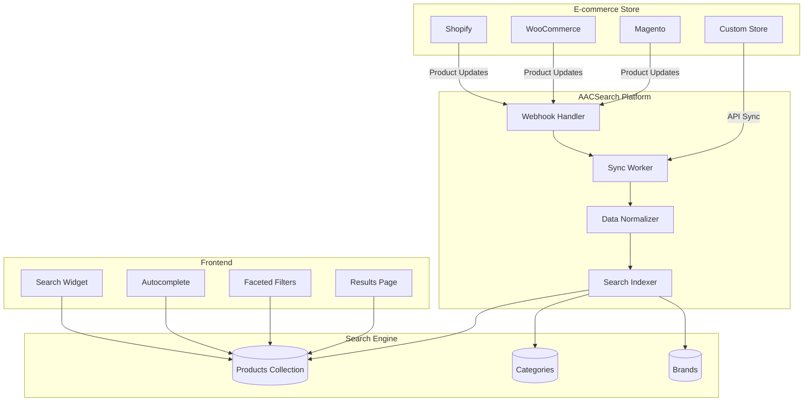
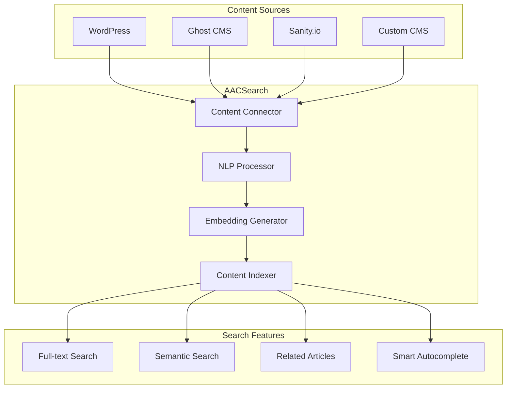

# Сценарии использования AACSearch

## Содержание

- [Сценарии использования AACSearch](#сценарии-использования-aacsearch)
  - [Содержание](#содержание)
  - [1. E-commerce поиск](#1-e-commerce-поиск)
    - [1.1. Архитектура решения](#11-архитектура-решения)
    - [1.2. Структура данных](#12-структура-данных)
    - [1.3. Конфигурация коллекции](#13-конфигурация-коллекции)
    - [1.4. Фасетная навигация](#14-фасетная-навигация)
    - [1.5. Merchandising](#15-merchandising)
    - [1.6. Интеграция с платформами](#16-интеграция-с-платформами)
    - [1.7. ROI и метрики](#17-roi-и-метрики)
  - [2. Контент-платформа / Блог](#2-контент-платформа--блог)
    - [2.1. Архитектура](#21-архитектура)
    - [2.2. Структура коллекций](#22-структура-коллекций)
    - [2.3. Семантический поиск статей](#23-семантический-поиск-статей)
    - [2.4. Multi-language контент](#24-multi-language-контент)
    - [2.5. Related Articles](#25-related-articles)
    - [2.6. Интеграция](#26-интеграция)
  - [3. SaaS приложение](#3-saas-приложение)
    - [3.1. Архитектура multi-tenant](#31-архитектура-multi-tenant)
    - [3.2. Встроенный поиск](#32-встроенный-поиск)
    - [3.3. White-label брендирование](#33-white-label-брендирование)
    - [3.4. Usage-based billing](#34-usage-based-billing)
    - [3.5. API-first интеграция](#35-api-first-интеграция)
  - [4. Enterprise документы](#4-enterprise-документы)
    - [4.1. Корпоративный поиск](#41-корпоративный-поиск)
    - [4.2. Permissions и ACL](#42-permissions-и-acl)
    - [4.3. GDPR Compliance](#43-gdpr-compliance)
    - [4.4. Audit Trail](#44-audit-trail)
    - [4.5. On-premise deployment](#45-on-premise-deployment)
  - [5. Geo-based приложения](#5-geo-based-приложения)
    - [5.1. Location Search](#51-location-search)
    - [5.2. Radius и Polygon фильтры](#52-radius-и-polygon-фильтры)
    - [5.3. Sort by Distance](#53-sort-by-distance)
    - [5.4. Map Integration](#54-map-integration)
    - [5.5. Real-time Updates](#55-real-time-updates)
  - [6. Дополнительные сценарии](#6-дополнительные-сценарии)
    - [6.1. Healthcare (поиск медицинских записей)](#61-healthcare-поиск-медицинских-записей)
    - [6.2. Education (онлайн-курсы)](#62-education-онлайн-курсы)
    - [6.3. Real Estate (недвижимость)](#63-real-estate-недвижимость)
    - [6.4. Job Board (поиск вакансий)](#64-job-board-поиск-вакансий)

---

## 1. E-commerce поиск

### 1.1. Архитектура решения



### 1.2. Структура данных

**Product Document:**
```typescript
interface Product {
  id: string
  title: string
  description: string
  sku: string
  price: number
  compareAtPrice?: number
  category: string[]
  brand: string
  tags: string[]
  images: Array<{
    url: string
    alt: string
  }>
  variants: Array<{
    id: string
    title: string
    sku: string
    price: number
    inventory: number
    options: {
      size?: string
      color?: string
      material?: string
    }
  }>
  stock: number
  rating: number
  reviewCount: number
  popularity: number  // Calculated field
  createdAt: number
  updatedAt: number
  // Metadata
  vendor: string
  productType: string
  collections: string[]
  // SEO
  metaTitle?: string
  metaDescription?: string
  handle: string
  // Search-specific
  embedding?: number[]  // For semantic search
}
```

**Пример документа:**
```json
{
  "id": "prod_123",
  "title": "MacBook Pro 16\" M3 Max",
  "description": "Powerful laptop for professionals with M3 Max chip, 36GB RAM, 1TB SSD",
  "sku": "MBP16-M3MAX-001",
  "price": 3499.99,
  "compareAtPrice": 3999.99,
  "category": ["Electronics", "Computers", "Laptops"],
  "brand": "Apple",
  "tags": ["premium", "professional", "m3", "apple silicon"],
  "images": [
    {
      "url": "https://cdn.example.com/mbp16-1.jpg",
      "alt": "MacBook Pro 16 inch front view"
    }
  ],
  "variants": [
    {
      "id": "var_1",
      "title": "Space Gray / 36GB / 1TB",
      "sku": "MBP16-SG-36-1TB",
      "price": 3499.99,
      "inventory": 15,
      "options": {
        "color": "Space Gray",
        "memory": "36GB",
        "storage": "1TB"
      }
    }
  ],
  "stock": 15,
  "rating": 4.8,
  "reviewCount": 142,
  "popularity": 95,
  "createdAt": 1704067200,
  "updatedAt": 1704153600,
  "vendor": "Apple Inc.",
  "productType": "Laptop",
  "collections": ["New Arrivals", "Best Sellers"],
  "handle": "macbook-pro-16-m3-max"
}
```

### 1.3. Конфигурация коллекции

**Typesense Schema:**
```typescript
const productsSchema = {
  name: 'products',
  fields: [
    // Text fields
    {name: 'id', type: 'string', facet: false},
    {name: 'title', type: 'string', infix: true, stem: true},
    {name: 'description', type: 'string', stem: true},
    {name: 'sku', type: 'string', facet: true},
    {name: 'brand', type: 'string', facet: true},
    {name: 'vendor', type: 'string', facet: true},
    {name: 'productType', type: 'string', facet: true},
    {name: 'handle', type: 'string', index: false},

    // Array fields
    {name: 'category', type: 'string[]', facet: true},
    {name: 'tags', type: 'string[]', facet: true},
    {name: 'collections', type: 'string[]', facet: true},

    // Numeric fields
    {name: 'price', type: 'float', facet: true, sort: true},
    {name: 'compareAtPrice', type: 'float', optional: true},
    {name: 'stock', type: 'int32', facet: true, sort: true},
    {name: 'rating', type: 'float', facet: true, sort: true},
    {name: 'reviewCount', type: 'int32', sort: true},
    {name: 'popularity', type: 'int32', sort: true},
    {name: 'createdAt', type: 'int64', sort: true},
    {name: 'updatedAt', type: 'int64', sort: true},

    // Nested objects (stored as strings)
    {name: 'variants', type: 'object[]', index: false, optional: true},
    {name: 'images', type: 'object[]', index: false, optional: true},

    // Semantic search
    {
      name: 'embedding',
      type: 'float[]',
      optional: true,
      embed: {
        from: ['title', 'description', 'category', 'tags'],
        model_config: {
          model_name: 'ts/all-MiniLM-L12-v2'
        }
      }
    }
  ],
  default_sorting_field: 'popularity',
  token_separators: ['-', '_', '/'],
  symbols_to_index: ['#', '@', '.']
}

await typesense.collections().create(productsSchema)
```

### 1.4. Фасетная навигация

**Поисковый запрос с фасетами:**
```typescript
const searchParams = {
  q: 'laptop',
  query_by: 'title,description,brand,category,tags',

  // Filters
  filter_by: [
    'price:[500..3000]',
    'stock:>0',
    'rating:>=4.0'
  ].join(' && '),

  // Facets
  facet_by: 'category,brand,price,rating,productType',
  max_facet_values: 50,

  // Sorting
  sort_by: 'popularity:desc,rating:desc',

  // Pagination
  per_page: 24,
  page: 1,

  // Search settings
  num_typos: 2,
  prefix: true,
  infix: 'fallback',
  split_join_tokens: 'fallback'
}

const results = await typesense.collections('products')
  .documents()
  .search(searchParams)
```

**Response с фасетами:**
```json
{
  "found": 342,
  "hits": [...],
  "facet_counts": [
    {
      "field_name": "category",
      "counts": [
        {"value": "Laptops", "count": 156},
        {"value": "Gaming Laptops", "count": 89},
        {"value": "Ultrabooks", "count": 97}
      ]
    },
    {
      "field_name": "brand",
      "counts": [
        {"value": "Apple", "count": 45},
        {"value": "Dell", "count": 67},
        {"value": "HP", "count": 54},
        {"value": "Lenovo", "count": 48},
        {"value": "ASUS", "count": 42}
      ]
    },
    {
      "field_name": "price",
      "stats": {
        "min": 499.99,
        "max": 2999.99,
        "avg": 1249.50
      }
    }
  ]
}
```

**Frontend фасеты (React):**
```typescript
import { Checkbox } from '@/components/ui/checkbox'

interface FacetProps {
  facets: FacetCounts
  selectedFilters: Record<string, string[]>
  onFilterChange: (field: string, value: string) => void
}

export function ProductFilters({ facets, selectedFilters, onFilterChange }: FacetProps) {
  return (
    <div className="space-y-6">
      {/* Category Filter */}
      <div>
        <h3 className="font-semibold mb-2">Category</h3>
        {facets.category.counts.map(({ value, count }) => (
          <label key={value} className="flex items-center space-x-2">
            <Checkbox
              checked={selectedFilters.category?.includes(value)}
              onCheckedChange={() => onFilterChange('category', value)}
            />
            <span>{value} ({count})</span>
          </label>
        ))}
      </div>

      {/* Brand Filter */}
      <div>
        <h3 className="font-semibold mb-2">Brand</h3>
        {facets.brand.counts.map(({ value, count }) => (
          <label key={value} className="flex items-center space-x-2">
            <Checkbox
              checked={selectedFilters.brand?.includes(value)}
              onCheckedChange={() => onFilterChange('brand', value)}
            />
            <span>{value} ({count})</span>
          </label>
        ))}
      </div>

      {/* Price Range Filter */}
      <div>
        <h3 className="font-semibold mb-2">Price</h3>
        <div className="space-y-2">
          <label className="flex items-center space-x-2">
            <Checkbox
              checked={selectedFilters.price?.includes('0-500')}
              onCheckedChange={() => onFilterChange('price', '0-500')}
            />
            <span>Under $500</span>
          </label>
          <label className="flex items-center space-x-2">
            <Checkbox
              checked={selectedFilters.price?.includes('500-1000')}
              onCheckedChange={() => onFilterChange('price', '500-1000')}
            />
            <span>$500 - $1000</span>
          </label>
          <label className="flex items-center space-x-2">
            <Checkbox
              checked={selectedFilters.price?.includes('1000-2000')}
              onCheckedChange={() => onFilterChange('price', '1000-2000')}
            />
            <span>$1000 - $2000</span>
          </label>
          <label className="flex items-center space-x-2">
            <Checkbox
              checked={selectedFilters.price?.includes('2000-9999')}
              onCheckedChange={() => onFilterChange('price', '2000-9999')}
            />
            <span>$2000+</span>
          </label>
        </div>
      </div>

      {/* Rating Filter */}
      <div>
        <h3 className="font-semibold mb-2">Rating</h3>
        {[5, 4, 3].map(rating => (
          <label key={rating} className="flex items-center space-x-2">
            <Checkbox
              checked={selectedFilters.rating?.includes(String(rating))}
              onCheckedChange={() => onFilterChange('rating', String(rating))}
            />
            <span>{'★'.repeat(rating)} & up</span>
          </label>
        ))}
      </div>
    </div>
  )
}
```

### 1.5. Merchandising

**Pinning топовых продуктов:**
```typescript
// Создание Override для топовых продуктов
const override = {
  rule: {
    query: 'laptop',
    match: 'exact'
  },
  includes: [
    {id: 'prod_featured_1', position: 1},
    {id: 'prod_featured_2', position: 2},
    {id: 'prod_sponsored_1', position: 5}
  ],
  excludes: [
    {id: 'prod_out_of_stock_1'}
  ]
}

await typesense.collections('products')
  .overrides()
  .upsert('laptop-featured', override)
```

**Curation Rules:**
```typescript
// Rule-based merchandising
interface CurationRule {
  trigger: {
    query?: string
    filter?: string
    date_range?: [Date, Date]
  }
  actions: {
    boost?: Array<{id: string; weight: number}>
    pin?: Array<{id: string; position: number}>
    hide?: string[]
    redirect?: string
  }
}

// Black Friday rule
const blackFridayRule: CurationRule = {
  trigger: {
    query: '*',
    date_range: [new Date('2024-11-29'), new Date('2024-12-01')]
  },
  actions: {
    boost: [
      {id: 'prod_bf_deal_1', weight: 10},
      {id: 'prod_bf_deal_2', weight: 10}
    ],
    pin: [
      {id: 'prod_bf_banner', position: 1}
    ]
  }
}
```

**Персонализация:**
```typescript
// User-based personalization
async function personalizedSearch(
  userId: string,
  query: string
): Promise<SearchResults> {
  // Get user history
  const userHistory = await getUserSearchHistory(userId)
  const viewedCategories = userHistory.viewedCategories
  const favoriteБренды = userHistory.favoriteBrands

  // Boost based on user preferences
  const boostRules = [
    ...viewedCategories.map(cat => `category:${cat}^2`),
    ...favoriteBrands.map(brand => `brand:${brand}^3`)
  ]

  return await typesense.collections('products')
    .documents()
    .search({
      q: query,
      query_by: 'title,description,brand',
      query_by_weights: '3,2,1',
      // Apply personalization boosts
      filter_by: boostRules.join(' || '),
      sort_by: '_text_match:desc,popularity:desc'
    })
}
```

### 1.6. Интеграция с платформами

**Shopify Integration:**
```typescript
// src/integrations/shopify/connector.ts
import Shopify from '@shopify/shopify-api'

export class ShopifyConnector {
  private client: Shopify

  async syncProducts(): Promise<void> {
    const products = await this.client.product.list()

    for (const product of products) {
      const normalized = this.normalizeProduct(product)
      await this.indexProduct(normalized)
    }
  }

  private normalizeProduct(shopifyProduct: any): Product {
    return {
      id: shopifyProduct.id.toString(),
      title: shopifyProduct.title,
      description: shopifyProduct.body_html,
      price: parseFloat(shopifyProduct.variants[0].price),
      images: shopifyProduct.images.map(img => ({
        url: img.src,
        alt: img.alt || shopifyProduct.title
      })),
      variants: shopifyProduct.variants.map(v => ({
        id: v.id.toString(),
        title: v.title,
        sku: v.sku,
        price: parseFloat(v.price),
        inventory: v.inventory_quantity,
        options: {
          ...v.option1 && {size: v.option1},
          ...v.option2 && {color: v.option2}
        }
      })),
      // ... rest of fields
    }
  }

  async handleWebhook(event: string, data: any): Promise<void> {
    switch (event) {
      case 'products/create':
      case 'products/update':
        await this.indexProduct(this.normalizeProduct(data))
        break

      case 'products/delete':
        await this.deleteProduct(data.id.toString())
        break
    }
  }
}
```

**WooCommerce Integration:**
```typescript
import WooCommerceRestApi from '@woocommerce/woocommerce-rest-api'

export class WooCommerceConnector {
  private api: WooCommerceRestApi

  constructor() {
    this.api = new WooCommerceRestApi({
      url: process.env.WOOCOMMERCE_URL!,
      consumerKey: process.env.WOOCOMMERCE_KEY!,
      consumerSecret: process.env.WOOCOMMERCE_SECRET!,
      version: 'wc/v3'
    })
  }

  async syncProducts(): Promise<void> {
    let page = 1
    let hasMore = true

    while (hasMore) {
      const response = await this.api.get('products', {
        per_page: 100,
        page
      })

      const products = response.data
      for (const product of products) {
        await this.indexProduct(this.normalizeProduct(product))
      }

      hasMore = products.length === 100
      page++
    }
  }

  private normalizeProduct(wcProduct: any): Product {
    return {
      id: wcProduct.id.toString(),
      title: wcProduct.name,
      description: wcProduct.description,
      price: parseFloat(wcProduct.price),
      category: wcProduct.categories.map(c => c.name),
      brand: wcProduct.brands?.[0]?.name || '',
      images: wcProduct.images.map(img => ({
        url: img.src,
        alt: img.alt
      })),
      stock: wcProduct.stock_quantity || 0,
      rating: parseFloat(wcProduct.average_rating) || 0,
      reviewCount: wcProduct.rating_count || 0,
      // ... rest
    }
  }
}
```

### 1.7. ROI и метрики

**Ключевые метрики:**
```typescript
interface EcommerceMetrics {
  // Search Performance
  searchConversionRate: number     // Searches → Purchases
  averageOrderValue: number        // AOV from search
  searchedProductCTR: number       // Click-through rate

  // User Engagement
  searchUsageRate: number          // % users who search
  avgSearchesPerSession: number
  zeroResultRate: number           // % searches with 0 results

  // Business Impact
  revenueFromSearch: number        // Total revenue from search
  searchRevenuePercentage: number  // % of total revenue
  avgTimeToConversion: number      // Time from search to purchase
}

// Tracking example
async function trackSearchConversion(
  sessionId: string,
  searchQuery: string,
  clickedProductId: string,
  purchased: boolean,
  orderValue?: number
): Promise<void> {
  await payload.create({
    collection: 'search_analytics',
    data: {
      sessionId,
      query: searchQuery,
      clickedProduct: clickedProductId,
      converted: purchased,
      orderValue,
      timestamp: new Date()
    }
  })

  // Update metrics
  if (purchased) {
    await redis.hincrby('metrics:search', 'conversions', 1)
    await redis.hincrbyfloat('metrics:search', 'revenue', orderValue || 0)
  }
}
```

**Типичные улучшения после внедрения:**
- 🎯 Конверсия: +25-40%
- 💰 AOV: +15-30%
- ⏱️ Time to Purchase: -20-35%
- 🔍 Search Usage: +40-60%
- ❌ Zero Results: -50-70%

---

## 2. Контент-платформа / Блог

### 2.1. Архитектура



### 2.2. Структура коллекций

**Posts Collection:**
```typescript
interface BlogPost {
  id: string
  title: string
  slug: string
  excerpt: string
  content: string                // Full HTML/Markdown
  plainContent: string           // Plain text для поиска

  // Metadata
  author: {
    id: string
    name: string
    avatar?: string
  }
  categories: string[]
  tags: string[]
  publishedAt: number
  updatedAt: number

  // SEO
  metaTitle?: string
  metaDescription?: string
  keywords?: string[]

  // Media
  featuredImage?: {
    url: string
    alt: string
  }

  // Stats
  views: number
  readTime: number              // Minutes
  commentCount: number
  shareCount: number

  // Search-specific
  embedding?: number[]          // Semantic search
  language: string              // 'en', 'ru', etc.

  // Content analysis
  sentiment?: 'positive' | 'neutral' | 'negative'
  topics?: string[]             // Auto-extracted topics
}
```

**Authors Collection:**
```typescript
interface Author {
  id: string
  name: string
  slug: string
  bio?: string
  avatar?: string
  social?: {
    twitter?: string
    github?: string
    linkedin?: string
  }
  postCount: number
  followerCount: number
}
```

**Schema:**
```typescript
const postsSchema = {
  name: 'posts',
  fields: [
    {name: 'id', type: 'string'},
    {name: 'title', type: 'string', infix: true, stem: true},
    {name: 'slug', type: 'string', facet: true},
    {name: 'excerpt', type: 'string', stem: true},
    {name: 'plainContent', type: 'string', stem: true},

    // Author (denormalized for search)
    {name: 'authorName', type: 'string', facet: true},
    {name: 'authorId', type: 'string', facet: true},

    // Categories & Tags
    {name: 'categories', type: 'string[]', facet: true},
    {name: 'tags', type: 'string[]', facet: true},
    {name: 'topics', type: 'string[]', facet: true},

    // Dates
    {name: 'publishedAt', type: 'int64', sort: true},
    {name: 'updatedAt', type: 'int64', sort: true},

    // Stats
    {name: 'views', type: 'int32', sort: true},
    {name: 'readTime', type: 'int32', facet: true},
    {name: 'commentCount', type: 'int32', sort: true},

    // Language
    {name: 'language', type: 'string', facet: true},

    // Semantic search
    {
      name: 'embedding',
      type: 'float[]',
      embed: {
        from: ['title', 'excerpt', 'plainContent'],
        model_config: {
          model_name: 'ts/all-MiniLM-L12-v2'
        }
      }
    }
  ],
  default_sorting_field: 'publishedAt',
  token_separators: ['-', '_', '.'],
  symbols_to_index: ['#', '@']
}
```

### 2.3. Семантический поиск статей

**Hybrid Search (keyword + semantic):**
```typescript
async function hybridSearch(query: string): Promise<BlogPost[]> {
  // 1. Keyword search
  const keywordResults = await typesense.collections('posts')
    .documents()
    .search({
      q: query,
      query_by: 'title,excerpt,plainContent',
      query_by_weights: '3,2,1',
      per_page: 50
    })

  // 2. Semantic search
  const semanticResults = await typesense.collections('posts')
    .documents()
    .search({
      q: query,
      query_by: 'embedding',
      vector_query: `embedding:([], k:50)`,
      per_page: 50
    })

  // 3. Merge and re-rank
  const merged = mergeResults(
    keywordResults.hits,
    semanticResults.hits,
    {
      keywordWeight: 0.6,
      semanticWeight: 0.4
    }
  )

  return merged.slice(0, 20)
}

function mergeResults(
  keywordHits: any[],
  semanticHits: any[],
  weights: {keywordWeight: number; semanticWeight: number}
): BlogPost[] {
  const scoreMap = new Map<string, number>()

  // Add keyword scores
  keywordHits.forEach((hit, index) => {
    const score = (1 / (index + 1)) * weights.keywordWeight
    scoreMap.set(hit.document.id, score)
  })

  // Add semantic scores
  semanticHits.forEach((hit, index) => {
    const score = (1 / (index + 1)) * weights.semanticWeight
    const existing = scoreMap.get(hit.document.id) || 0
    scoreMap.set(hit.document.id, existing + score)
  })

  // Sort by combined score
  const allDocs = [...keywordHits, ...semanticHits]
    .map(hit => hit.document)
    .filter((doc, index, self) =>
      index === self.findIndex(d => d.id === doc.id)
    )

  return allDocs.sort((a, b) => {
    const scoreA = scoreMap.get(a.id) || 0
    const scoreB = scoreMap.get(b.id) || 0
    return scoreB - scoreA
  })
}
```

### 2.4. Multi-language контент

**Language Detection:**
```typescript
import { franc } from 'franc'

async function indexBlogPost(post: BlogPost): Promise<void> {
  // Auto-detect language if not provided
  const language = post.language || franc(post.content)

  // Index with language-specific settings
  await typesense.collections('posts')
    .documents()
    .upsert({
      ...post,
      language,
      // Language-specific fields
      title_${language}: post.title,
      content_${language}: post.plainContent
    })
}
```

**Multi-language Search:**
```typescript
async function multilingualSearch(
  query: string,
  userLanguage: string
): Promise<BlogPost[]> {
  return await typesense.collections('posts')
    .documents()
    .search({
      q: query,
      query_by: `title,excerpt,plainContent,title_${userLanguage},content_${userLanguage}`,
      query_by_weights: '3,2,1,4,2',
      filter_by: `language:=${userLanguage}`,
      sort_by: 'publishedAt:desc'
    })
}
```

### 2.5. Related Articles

**Vector-based Similarity:**
```typescript
async function getRelatedArticles(
  postId: string,
  limit: number = 5
): Promise<BlogPost[]> {
  // Get current post
  const currentPost = await typesense.collections('posts')
    .documents(postId)
    .retrieve()

  // Find similar by embedding
  const related = await typesense.collections('posts')
    .documents()
    .search({
      q: '*',
      vector_query: `embedding:([${currentPost.embedding.join(',')}], k:${limit + 1})`,
      filter_by: `id:!=${postId}`,
      exclude_fields: 'embedding,plainContent',
      per_page: limit
    })

  return related.hits.map(hit => hit.document)
}
```

**Category-based + Popularity:**
```typescript
async function getRelatedByCategory(
  post: BlogPost,
  limit: number = 5
): Promise<BlogPost[]> {
  const categoryFilters = post.categories
    .map(cat => `categories:=${cat}`)
    .join(' || ')

  return await typesense.collections('posts')
    .documents()
    .search({
      q: '*',
      filter_by: `(${categoryFilters}) && id:!=${post.id}`,
      sort_by: 'views:desc,publishedAt:desc',
      per_page: limit
    })
}
```

### 2.6. Интеграция

**WordPress REST API:**
```typescript
export class WordPressConnector {
  async syncPosts(): Promise<void> {
    const response = await fetch(`${this.baseUrl}/wp-json/wp/v2/posts?per_page=100`)
    const posts = await response.json()

    for (const wpPost of posts) {
      const normalized = this.normalizePost(wpPost)
      await this.indexPost(normalized)
    }
  }

  private normalizePost(wpPost: any): BlogPost {
    return {
      id: wpPost.id.toString(),
      title: wpPost.title.rendered,
      slug: wpPost.slug,
      excerpt: this.stripHtml(wpPost.excerpt.rendered),
      content: wpPost.content.rendered,
      plainContent: this.stripHtml(wpPost.content.rendered),
      categories: wpPost.categories.map(String),
      tags: wpPost.tags.map(String),
      publishedAt: new Date(wpPost.date).getTime(),
      updatedAt: new Date(wpPost.modified).getTime(),
      language: wpPost.lang || 'en'
    }
  }

  private stripHtml(html: string): string {
    return html.replace(/<[^>]*>/g, '').trim()
  }
}
```

---

## 3. SaaS приложение

### 3.1. Архитектура multi-tenant

**Tenant Isolation:**
```typescript
// Each tenant gets isolated collection prefix
function getTenantCollectionName(tenantId: string, collection: string): string {
  return `${tenantId}_${collection}`
}

// Or single collection with tenant filter
async function searchWithTenantIsolation(
  tenantId: string,
  query: string
): Promise<SearchResults> {
  return await typesense.collections('documents')
    .documents()
    .search({
      q: query,
      query_by: 'title,content',
      filter_by: `tenant:=${tenantId}`,  // Always filter by tenant
      per_page: 20
    })
}
```

### 3.2. Встроенный поиск

**Search Widget для клиентов:**
```typescript
// Embeddable search widget
<script src="https://cdn.aacsearch.com/widget.js"></script>
<script>
  AACSearch.init({
    apiKey: 'your-scoped-api-key',
    collections: ['products', 'articles'],
    container: '#search-container',
    theme: {
      primaryColor: '#007bff',
      borderRadius: '8px'
    }
  })
</script>

<div id="search-container"></div>
```

**React Component:**
```typescript
import { AACSearchProvider, SearchBox, Hits } from '@aacsearch/react'

export function App() {
  return (
    <AACSearchProvider
      apiKey={process.env.NEXT_PUBLIC_AACSEARCH_KEY}
      collections={['products']}
    >
      <SearchBox placeholder="Search products..." />
      <Hits
        hitComponent={({ hit }) => (
          <div>
            <h3>{hit.title}</h3>
            <p>{hit.description}</p>
            <span>${hit.price}</span>
          </div>
        )}
      />
    </AACSearchProvider>
  )
}
```

### 3.3. White-label брендирование

**Customizable UI:**
```typescript
interface BrandConfig {
  logo?: string
  primaryColor: string
  secondaryColor: string
  fontFamily: string
  borderRadius: string
  customCSS?: string
}

const brandConfig: BrandConfig = {
  logo: 'https://customer.com/logo.png',
  primaryColor: '#FF6B00',
  secondaryColor: '#333333',
  fontFamily: 'Inter, sans-serif',
  borderRadius: '12px',
  customCSS: `
    .search-results {
      background: linear-gradient(to bottom, #fff, #f5f5f5);
    }
  `
}

<AACSearch config={brandConfig} />
```

### 3.4. Usage-based billing

**Tracking и Billing:**
```typescript
// Track search usage
await trackUsageEvent(
  payload,
  tenantId,
  'search',
  1  // quantity
)

// Check limits before search
const limit = await checkUsageLimit(
  payload,
  tenantId,
  'searches'
)

if (!limit.allowed) {
  return Response.json({
    error: 'Search limit exceeded',
    limit: limit.limit,
    usage: limit.usage
  }, {status: 429})
}

// Perform search and track
const results = await search(query)
await trackUsageEvent(payload, tenantId, 'search', 1)
```

### 3.5. API-first интеграция

**REST API:**
```typescript
// POST /api/search
const response = await fetch('https://api.aacsearch.com/search', {
  method: 'POST',
  headers: {
    'X-API-Key': apiKey,
    'Content-Type': 'application/json'
  },
  body: JSON.stringify({
    collection: 'products',
    q: 'laptop',
    filters: {
      price: {min: 500, max: 2000},
      category: ['Electronics']
    },
    page: 1,
    per_page: 20
  })
})

const data = await response.json()
```

**GraphQL API:**
```graphql
query SearchProducts($query: String!, $filters: SearchFilters) {
  search(collection: "products", query: $query, filters: $filters) {
    total
    hits {
      id
      title
      description
      price
      image
    }
    facets {
      category {
        value
        count
      }
      brand {
        value
        count
      }
    }
  }
}
```

---

## 4. Enterprise документы

### 4.1. Корпоративный поиск

**Document Schema:**
```typescript
interface EnterpriseDocument {
  id: string
  title: string
  content: string
  fileType: 'pdf' | 'docx' | 'txt' | 'xlsx' | 'pptx'
  fileSize: number
  filePath: string

  // Metadata
  author: string
  department: string
  project?: string
  tags: string[]

  // Dates
  createdAt: number
  modifiedAt: number
  accessedAt?: number

  // Permissions
  owner: string
  permissions: {
    users: string[]
    groups: string[]
    departments: string[]
  }
  confidentiality: 'public' | 'internal' | 'confidential' | 'secret'

  // Content analysis
  pageCount?: number
  wordCount?: number
  language: string

  // Search
  embedding?: number[]

  // Compliance
  retention: {
    period: number  // days
    deleteAfter?: number
  }
  classification: string
  auditLog: Array<{
    action: string
    user: string
    timestamp: number
  }>
}
```

### 4.2. Permissions и ACL

**Row-Level Security в поиске:**
```typescript
async function searchWithPermissions(
  query: string,
  userId: string
): Promise<EnterpriseDocument[]> {
  // Get user's groups and department
  const user = await getUserProfile(userId)
  const userGroups = user.groups
  const userDepartment = user.department

  // Build permission filter
  const permissionFilters = [
    `permissions.users:=${userId}`,
    ...userGroups.map(g => `permissions.groups:=${g}`),
    `permissions.departments:=${userDepartment}`,
    `confidentiality:=public`
  ].join(' || ')

  return await typesense.collections('documents')
    .documents()
    .search({
      q: query,
      query_by: 'title,content',
      filter_by: `(${permissionFilters})`,
      per_page: 50
    })
}
```

### 4.3. GDPR Compliance

**Personal Data Handling:**
```typescript
// Mark fields as PII
const documentSchema = {
  name: 'documents',
  fields: [
    {name: 'title', type: 'string'},
    {name: 'content', type: 'string'},
    {
      name: 'author',
      type: 'string',
      // Mark as PII for GDPR
      optional: true,
      index: false  // Don't index PII
    }
  ]
}

// Right to be forgotten
async function deleteUserData(userId: string): Promise<void> {
  // Delete user's documents
  await typesense.collections('documents')
    .documents()
    .delete({
      filter_by: `owner:=${userId}`
    })

  // Anonymize references
  await typesense.collections('documents')
    .documents()
    .update({
      filter_by: `author:=${userId}`,
      author: 'ANONYMIZED'
    })
}
```

### 4.4. Audit Trail

**Comprehensive Logging:**
```typescript
async function auditSearchAccess(
  userId: string,
  documentId: string,
  action: 'view' | 'download' | 'share'
): Promise<void> {
  await payload.create({
    collection: 'audit_log',
    data: {
      userId,
      documentId,
      action,
      timestamp: new Date(),
      ipAddress: req.ip,
      userAgent: req.headers['user-agent']
    }
  })

  // Update document access time
  await typesense.collections('documents')
    .documents(documentId)
    .update({
      accessedAt: Date.now()
    })
}
```

### 4.5. On-premise deployment

**Docker Compose для on-premise:**
```yaml
version: '3.9'

services:
  app:
    image: aacsearch/enterprise:latest
    ports:
      - "443:3000"
    environment:
      - DATABASE_URI=postgresql://...
      - REDIS_HOST=redis
      - TYPESENSE_HOST=typesense
      - ENTERPRISE_LICENSE_KEY=${LICENSE_KEY}
    volumes:
      - ./config:/app/config
      - ./certs:/app/certs
    networks:
      - aacsearch-internal

  postgres:
    image: postgres:15-alpine
    volumes:
      - postgres_data:/var/lib/postgresql/data
    networks:
      - aacsearch-internal

  redis:
    image: redis:7-alpine
    volumes:
      - redis_data:/data
    networks:
      - aacsearch-internal

  typesense:
    image: typesense/typesense:26.0
    volumes:
      - typesense_data:/data
    networks:
      - aacsearch-internal

networks:
  aacsearch-internal:
    driver: bridge

volumes:
  postgres_data:
  redis_data:
  typesense_data:
```

---

## 5. Geo-based приложения

### 5.1. Location Search

**Restaurant Schema:**
```typescript
interface Restaurant {
  id: string
  name: string
  description: string
  cuisine: string[]
  priceRange: 1 | 2 | 3 | 4  // $ - $$$$
  rating: number
  reviewCount: number

  // Location
  location: [number, number]  // [lat, lng]
  address: {
    street: string
    city: string
    state: string
    zip: string
    country: string
  }

  // Features
  features: string[]  // ['outdoor seating', 'wifi', 'parking']
  hours: {
    [key: string]: {open: string; close: string}
  }

  // Menu
  menuUrl?: string
  popularDishes: string[]
}

const restaurantsSchema = {
  name: 'restaurants',
  fields: [
    {name: 'name', type: 'string', infix: true},
    {name: 'description', type: 'string'},
    {name: 'cuisine', type: 'string[]', facet: true},
    {name: 'priceRange', type: 'int32', facet: true},
    {name: 'rating', type: 'float', facet: true, sort: true},
    {name: 'location', type: 'geopoint'},
    {name: 'city', type: 'string', facet: true},
    {name: 'features', type: 'string[]', facet: true}
  ]
}
```

### 5.2. Radius и Polygon фильтры

**Radius Search:**
```typescript
async function searchNearby(
  lat: number,
  lng: number,
  radiusKm: number
): Promise<Restaurant[]> {
  return await typesense.collections('restaurants')
    .documents()
    .search({
      q: '*',
      filter_by: `location:(${lat}, ${lng}, ${radiusKm} km)`,
      sort_by: `location(${lat}, ${lng}):asc`,
      per_page: 50
    })
}
```

**Polygon Search:**
```typescript
async function searchInArea(
  polygon: Array<[number, number]>
): Promise<Restaurant[]> {
  // Convert polygon to filter
  const polygonString = polygon
    .map(([lat, lng]) => `${lat},${lng}`)
    .join(':')

  return await typesense.collections('restaurants')
    .documents()
    .search({
      q: '*',
      filter_by: `location:(polygon: ${polygonString})`,
      per_page: 100
    })
}
```

### 5.3. Sort by Distance

```typescript
async function searchRestaurants(
  query: string,
  userLocation: [number, number],
  filters: {
    cuisine?: string[]
    priceRange?: number[]
    rating?: number
    features?: string[]
  }
): Promise<Restaurant[]> {
  const [lat, lng] = userLocation

  const filterParts = []

  if (filters.cuisine) {
    const cuisineFilter = filters.cuisine
      .map(c => `cuisine:=${c}`)
      .join(' || ')
    filterParts.push(`(${cuisineFilter})`)
  }

  if (filters.priceRange) {
    filterParts.push(`priceRange:[${filters.priceRange[0]}..${filters.priceRange[1]}]`)
  }

  if (filters.rating) {
    filterParts.push(`rating:>=${filters.rating}`)
  }

  const results = await typesense.collections('restaurants')
    .documents()
    .search({
      q: query,
      query_by: 'name,description,cuisine',
      filter_by: filterParts.join(' && '),
      sort_by: `location(${lat}, ${lng}):asc,rating:desc`,
      per_page: 20
    })

  // Add distance to results
  return results.hits.map(hit => ({
    ...hit.document,
    distance: calculateDistance(userLocation, hit.document.location)
  }))
}

function calculateDistance(
  point1: [number, number],
  point2: [number, number]
): number {
  const [lat1, lng1] = point1
  const [lat2, lng2] = point2

  const R = 6371 // Earth radius in km
  const dLat = toRad(lat2 - lat1)
  const dLng = toRad(lng2 - lng1)

  const a = Math.sin(dLat / 2) * Math.sin(dLat / 2) +
    Math.cos(toRad(lat1)) * Math.cos(toRad(lat2)) *
    Math.sin(dLng / 2) * Math.sin(dLng / 2)

  const c = 2 * Math.atan2(Math.sqrt(a), Math.sqrt(1 - a))
  return R * c
}

function toRad(degrees: number): number {
  return degrees * (Math.PI / 180)
}
```

### 5.4. Map Integration

**Mapbox Integration:**
```typescript
import mapboxgl from 'mapbox-gl'

export function RestaurantMap({ results, userLocation }: Props) {
  useEffect(() => {
    const map = new mapboxgl.Map({
      container: 'map',
      style: 'mapbox://styles/mapbox/streets-v11',
      center: userLocation,
      zoom: 12
    })

    // Add user location marker
    new mapboxgl.Marker({ color: '#007bff' })
      .setLngLat(userLocation)
      .addTo(map)

    // Add restaurant markers
    results.forEach(restaurant => {
      const popup = new mapboxgl.Popup()
        .setHTML(`
          <h3>${restaurant.name}</h3>
          <p>${restaurant.cuisine.join(', ')}</p>
          <p>⭐ ${restaurant.rating} (${restaurant.reviewCount})</p>
          <p>${restaurant.distance.toFixed(1)} km away</p>
        `)

      new mapboxgl.Marker()
        .setLngLat(restaurant.location)
        .setPopup(popup)
        .addTo(map)
    })

    return () => map.remove()
  }, [results, userLocation])

  return <div id="map" style={{ width: '100%', height: '500px' }} />
}
```

### 5.5. Real-time Updates

**Live Location Updates:**
```typescript
// Update user location in real-time
navigator.geolocation.watchPosition(async (position) => {
  const newLocation: [number, number] = [
    position.coords.latitude,
    position.coords.longitude
  ]

  // Re-search with new location
  const results = await searchNearby(
    newLocation[0],
    newLocation[1],
    5 // 5km radius
  )

  updateResults(results)
})
```

---

## 6. Дополнительные сценарии

### 6.1. Healthcare (поиск медицинских записей)

**Patient Records:**
```typescript
interface MedicalRecord {
  id: string
  patientId: string
  patientName: string  // Encrypted
  diagnosis: string[]
  medications: string[]
  procedures: string[]
  notes: string  // Full-text searchable
  doctor: string
  department: string
  visitDate: number

  // Compliance
  hipaaCompliant: boolean
  accessLog: Array<{
    userId: string
    timestamp: number
    action: string
  }>
}
```

**HIPAA-compliant Search:**
```typescript
async function searchMedicalRecords(
  query: string,
  doctorId: string
): Promise<MedicalRecord[]> {
  // Verify doctor has access
  const doctor = await verifyDoctor(doctorId)

  // Search only authorized records
  const results = await typesense.collections('medical_records')
    .documents()
    .search({
      q: query,
      query_by: 'diagnosis,medications,notes',
      filter_by: `doctor:=${doctorId} || department:=${doctor.department}`,
      per_page: 20
    })

  // Log access for HIPAA audit
  for (const record of results.hits) {
    await logMedicalAccess(doctorId, record.document.id, 'search')
  }

  return results.hits.map(hit => hit.document)
}
```

### 6.2. Education (онлайн-курсы)

**Course Schema:**
```typescript
interface Course {
  id: string
  title: string
  description: string
  instructor: string
  category: string[]
  level: 'beginner' | 'intermediate' | 'advanced'
  duration: number  // hours
  price: number
  rating: number
  studentCount: number

  // Content
  modules: Array<{
    title: string
    lessons: number
  }>
  skills: string[]
  language: string

  // Dates
  publishedAt: number
  updatedAt: number
}
```

**Personalized Course Recommendations:**
```typescript
async function recommendCourses(
  userId: string
): Promise<Course[]> {
  // Get user's completed courses and skills
  const userProfile = await getUserProfile(userId)
  const completedSkills = userProfile.skills
  const currentLevel = userProfile.level

  // Search for next-level courses
  return await typesense.collections('courses')
    .documents()
    .search({
      q: completedSkills.join(' '),
      query_by: 'title,description,skills',
      filter_by: `level:=${getNextLevel(currentLevel)}`,
      sort_by: 'rating:desc,studentCount:desc',
      per_page: 10
    })
}
```

### 6.3. Real Estate (недвижимость)

**Property Schema:**
```typescript
interface Property {
  id: string
  title: string
  description: string
  type: 'apartment' | 'house' | 'condo' | 'land'
  price: number
  area: number  // sq meters
  bedrooms: number
  bathrooms: number

  // Location
  location: [number, number]
  address: {
    street: string
    city: string
    state: string
    zip: string
  }

  // Features
  features: string[]  // ['pool', 'garage', 'garden']
  yearBuilt: number

  // Media
  images: string[]
  virtualTour?: string

  // Status
  status: 'sale' | 'rent' | 'sold'
  listingDate: number
}
```

**Property Search:**
```typescript
async function searchProperties(
  filters: {
    location?: [number, number]
    radius?: number
    priceMin?: number
    priceMax?: number
    bedrooms?: number
    type?: string[]
  }
): Promise<Property[]> {
  const filterParts = []

  if (filters.location && filters.radius) {
    const [lat, lng] = filters.location
    filterParts.push(`location:(${lat}, ${lng}, ${filters.radius} km)`)
  }

  if (filters.priceMin || filters.priceMax) {
    filterParts.push(`price:[${filters.priceMin || 0}..${filters.priceMax || 999999999}]`)
  }

  if (filters.bedrooms) {
    filterParts.push(`bedrooms:>=${filters.bedrooms}`)
  }

  return await typesense.collections('properties')
    .documents()
    .search({
      q: '*',
      filter_by: filterParts.join(' && '),
      sort_by: filters.location
        ? `location(${filters.location[0]}, ${filters.location[1]}):asc`
        : 'listingDate:desc',
      per_page: 50
    })
}
```

### 6.4. Job Board (поиск вакансий)

**Job Schema:**
```typescript
interface Job {
  id: string
  title: string
  company: string
  description: string
  requirements: string[]
  skills: string[]

  // Details
  type: 'full-time' | 'part-time' | 'contract' | 'remote'
  level: 'entry' | 'mid' | 'senior' | 'lead'
  salary: {
    min: number
    max: number
    currency: string
  }

  // Location
  location: [number, number]
  city: string
  remote: boolean

  // Dates
  postedAt: number
  expiresAt: number
}
```

**Smart Job Matching:**
```typescript
async function matchJobs(
  userProfile: {
    skills: string[]
    experience: number
    location: [number, number]
    salaryExpectation: number
  }
): Promise<Job[]> {
  // Build skill match query
  const skillsQuery = userProfile.skills.join(' OR ')

  // Determine level based on experience
  const level = userProfile.experience < 2 ? 'entry' :
                userProfile.experience < 5 ? 'mid' :
                userProfile.experience < 10 ? 'senior' : 'lead'

  return await typesense.collections('jobs')
    .documents()
    .search({
      q: skillsQuery,
      query_by: 'title,description,skills,requirements',
      filter_by: [
        `level:=${level}`,
        `salary.min:<=${userProfile.salaryExpectation}`,
        `location:(${userProfile.location[0]}, ${userProfile.location[1]}, 50 km) || remote:=true`
      ].join(' && '),
      sort_by: '_text_match:desc,postedAt:desc',
      per_page: 20
    })
}
```

---

## Заключение

Платформа AACSearch подходит для широкого спектра применений:

**Основные сценарии:**
1. ✅ **E-commerce** - фасетная навигация, мерчендайзинг, персонализация
2. ✅ **Контент** - семантический поиск, multi-language, related articles
3. ✅ **SaaS** - multi-tenant, white-label, usage-based billing
4. ✅ **Enterprise** - permissions, GDPR, audit trail
5. ✅ **Geo-based** - location search, radius filters, map integration

**Дополнительные применения:**
- Healthcare (медицинские записи с HIPAA compliance)
- Education (курсы и персонализированные рекомендации)
- Real Estate (поиск недвижимости с geo-фильтрами)
- Job Board (умный matching вакансий и кандидатов)

**Общие преимущества:**
- 🎯 Высокая точность поиска
- ⚡ Мгновенные результаты (< 50ms)
- 📊 Детальная аналитика
- 🔒 Enterprise-grade безопасность
- 🌍 Масштабируемость

Следующий раздел: [Сравнение с конкурентами](./06-comparison.md)
