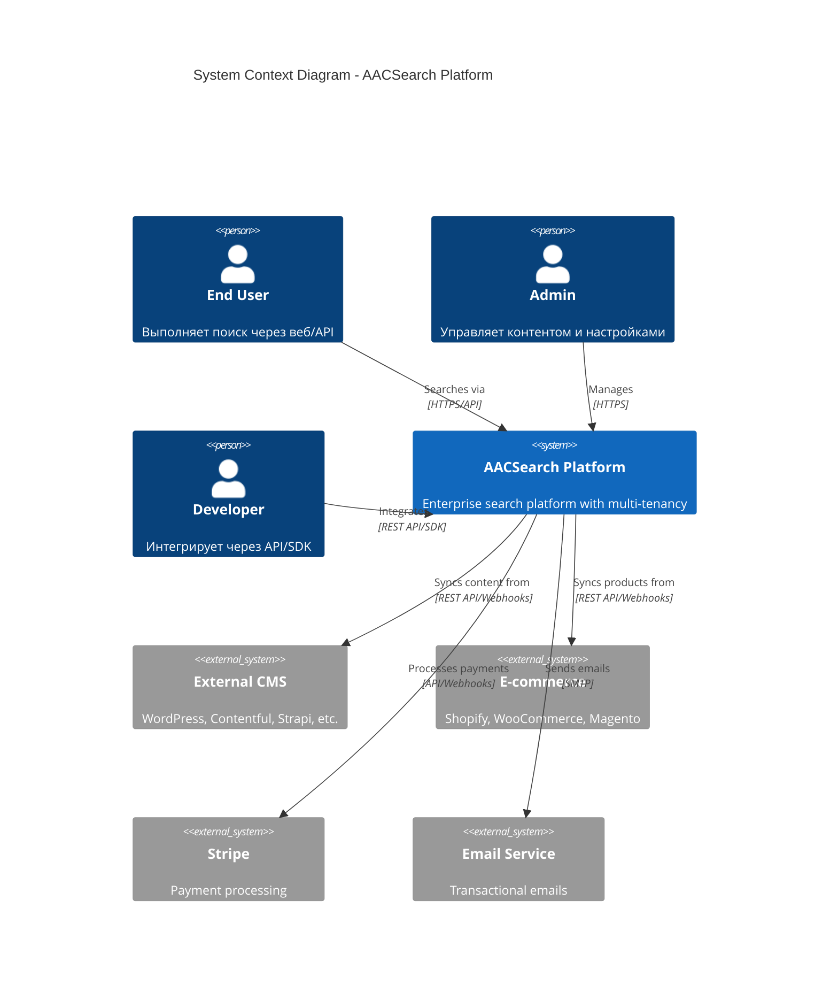
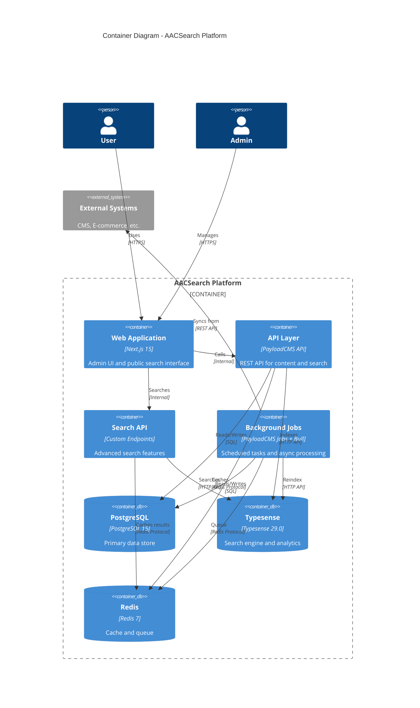
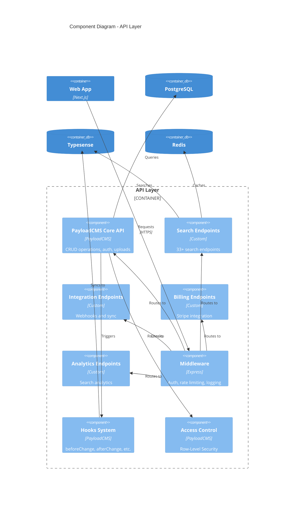
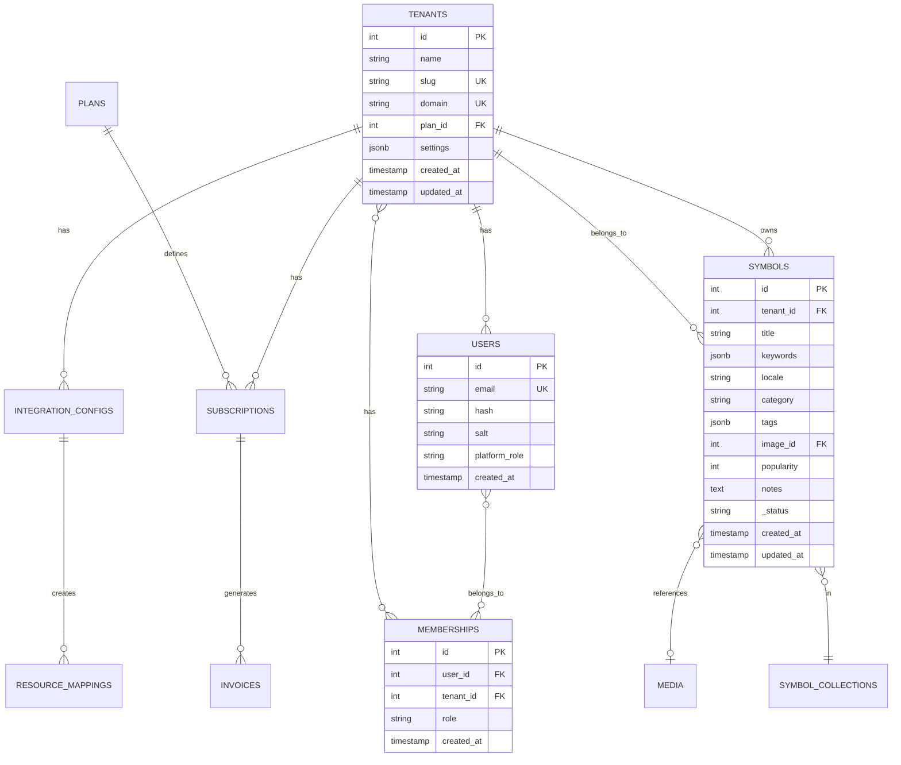
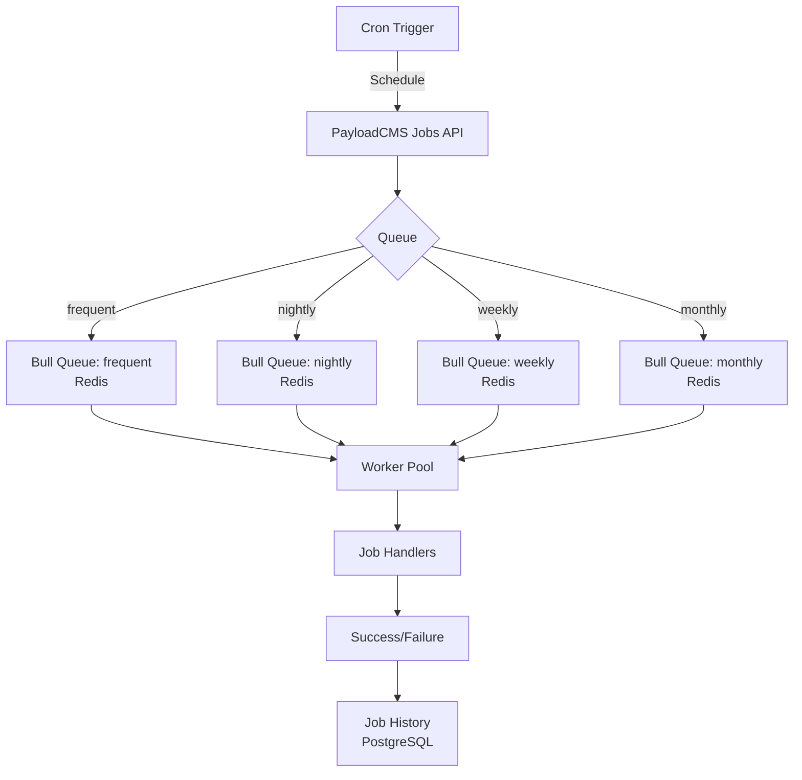
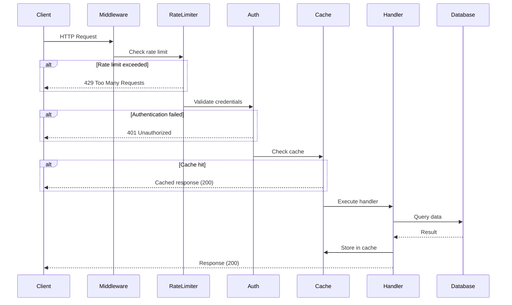
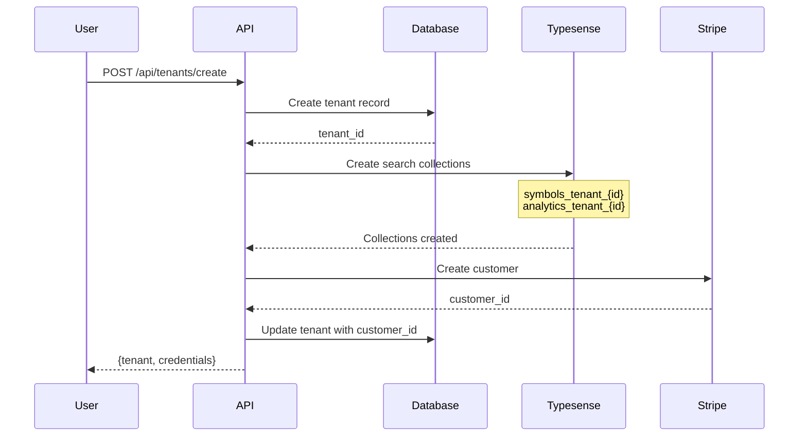

# Архитектура системы

Полное руководство по архитектуре AACSearch Platform - enterprise-ready поисковой платформы с multi-tenancy, построенной на PayloadCMS, Typesense и Next.js.

## Содержание

- [High-Level Architecture](#high-level-architecture)
- [Архитектурные принципы](#архитектурные-принципы)
- [Компоненты системы](#компоненты-системы)
- [Database архитектура](#database-архитектура)
- [Search Engine интеграция](#search-engine-интеграция)
- [Caching layers](#caching-layers)
- [Message Queues & Jobs](#message-queues--jobs)
- [API Gateway](#api-gateway)
- [Multi-tenancy](#multi-tenancy)
- [Real-time синхронизация](#real-time-синхронизация)
- [Scaling стратегии](#scaling-стратегии)
- [Security архитектура](#security-архитектура)
- [Monitoring & Observability](#monitoring--observability)
- [Data Flow](#data-flow)

---

## High-Level Architecture

AACSearch Platform построена по modern microservices-подобной архитектуре с монолитным core и расширяемой plugin системой.

### C4 Context Diagram



### C4 Container Diagram



### C4 Component Diagram



---

## Архитектурные принципы

### 1. Multi-Tenancy First

Платформа спроектирована для поддержки тысяч tenants:

- **Data Isolation**: Каждый tenant имеет логически изолированные данные
- **Resource Isolation**: Отдельные search indexes для каждого tenant
- **Security**: Row-Level Security (RLS) на уровне БД
- **Scalability**: Горизонтальное масштабирование по tenants

```typescript
// Пример tenant isolation в коде
interface TenantAware {
  tenant: string | Tenant
}

// Все коллекции с tenant field
export const Symbols: CollectionConfig = {
  slug: 'symbols',
  fields: [
    {
      name: 'tenant',
      type: 'relationship',
      relationTo: 'tenants',
      required: true,
    },
    // ... другие поля
  ],
  // Row-level security через access control
  access: {
    read: ({ req }) => ({
      tenant: { equals: req.user.tenantId }
    }),
  },
}
```

### 2. Dual-Write Pattern

Данные синхронизируются между PostgreSQL и Typesense:

```
┌──────────────┐
│   Request    │
└──────┬───────┘
       │
       ▼
┌──────────────────┐
│  PayloadCMS API  │
└──────┬───────────┘
       │
       ├────────────────────┐
       │                    │
       ▼                    ▼
┌─────────────┐      ┌─────────────┐
│ PostgreSQL  │      │  Typesense  │
│ (Source of  │      │  (Search &  │
│  Truth)     │      │  Analytics) │
└─────────────┘      └─────────────┘
```

**Преимущества**:
- PostgreSQL - ACID compliance, complex queries, relationships
- Typesense - blazing fast search, faceting, typo tolerance, analytics
- Fallback на PostgreSQL при недоступности Typesense

**Реализация** через PayloadCMS hooks:

```typescript
// src/collections/Symbols.ts
hooks: {
  afterChange: [
    async ({ doc, req, context }) => {
      if (context?.skipTypesenseSync) return

      // Sync to Typesense
      await upsertTS('symbols', {
        id: String(doc.id),
        tenant: String(doc.tenant),
        title: doc.title,
        // ... mapping fields
      })
    },
  ],
  afterDelete: [
    async ({ doc }) => {
      await deleteTS('symbols', String(doc.id))
    },
  ],
}
```

### 3. Plugin Architecture

Расширяемость через плагины:

```typescript
// src/payload.config.ts
export default buildConfig({
  plugins: [
    // PayloadCMS официальные плагины
    seoPlugin(),
    redirectsPlugin(),

    // Custom плагины
    dynamicCollectionsPlugin(),
    searchAnalyticsPlugin(),
    billingPlugin(),
  ],
})
```

### 4. API-First Design

Все функции доступны через API:

- **REST API** - полный CRUD для всех коллекций
- **Search API** - 33+ специализированных endpoints
- **Webhooks** - real-time уведомления
- **GraphQL** - опционально через PayloadCMS

### 5. Zero-Downtime Operations

Критичные операции выполняются без простоя:

- **Reindexing** - через alias switching
- **Schema changes** - через миграции
- **Deployments** - blue-green deployment
- **Scaling** - horizontal pod autoscaling

---

## Компоненты системы

### 1. PayloadCMS Core

**Роль**: Content Management System и API layer

**Возможности**:
- 32 коллекции (collections) для различных типов данных
- Built-in authentication & authorization
- File uploads и media management
- Версионирование контента (drafts)
- GraphQL + REST API
- Admin UI (React Server Components)

**Ключевые коллекции**:

```typescript
// Multi-tenant & Auth
Tenants          // Организации
Users            // Пользователи
Memberships      // Связь users ↔ tenants

// Billing
Plans            // Тарифные планы
Subscriptions    // Подписки tenants
Invoices         // Счета
APIKeys          // API ключи
UsageCounters    // Счетчики использования

// Content
Symbols          // Основной контент для поиска
SymbolCollections // Группировка symbols
Media            // Файлы и изображения
Pages            // CMS pages
Posts            // Blog posts
Categories       // Таксономия

// Search Management
TS_Synonyms      // Синонимы для поиска
TS_Overrides     // Overrides результатов
TS_Stopwords     // Stop-слова
SearchPresets    // Сохраненные конфигурации поиска
SearchSuggestions // Автодополнение
SearchAnalytics  // Аналитика поисковых запросов

// Integrations
IntegrationConfigs // Настройки интеграций
ResourceMappings   // Маппинг external → internal IDs

// Advanced Features
NLSearchModels      // Natural Language поиск
ConversationModels  // Conversational search
ConversationStore   // История разговоров
WizardConfigs       // Onboarding wizard
```

### 2. Typesense Search Engine

**Роль**: High-performance search и analytics

**Версия**: 29.0+ (latest features)

**Основные возможности**:
- **Full-text search** с typo tolerance
- **Faceted search** и filtering
- **Geo search** с distance calculations
- **Vector search** для semantic similarity
- **Image search** через embeddings
- **Joins** между коллекциями
- **Analytics** из коробки
- **Natural Language** search (OpenAI/Claude integration)
- **Conversational** search
- **Grouping** и aggregations

**Collection schema example**:

```typescript
// src/typesense/schemas/symbols.ts
const symbolsSchema: CollectionCreateSchema = {
  name: 'symbols_tenant_{tenantId}', // per-tenant collections
  fields: [
    { name: 'id', type: 'string' },
    { name: 'tenant', type: 'string', facet: true },
    { name: 'title', type: 'string' },
    { name: 'keywords', type: 'string[]' },
    { name: 'locale', type: 'string', facet: true },
    { name: 'category', type: 'string', facet: true, optional: true },
    { name: 'tags', type: 'string[]', facet: true },
    { name: 'popularity', type: 'int32', facet: true },
    { name: 'createdAt', type: 'int64' },
    { name: 'updatedAt', type: 'int64' },
    // Geo search support
    { name: 'location', type: 'geopoint', optional: true },
    // Vector search support
    { name: 'embedding', type: 'float[]', num_dim: 384, optional: true },
  ],
  default_sorting_field: 'popularity',
  token_separators: ['-', '_'],
  symbols_to_index: ['@', '#', '$'],
}
```

### 3. PostgreSQL Database

**Роль**: Primary data store (source of truth)

**Версия**: 15+

**Конфигурация**:
- **Connection pooling** через PgBouncer
- **Row-Level Security** для multi-tenancy
- **Indexes** на критичных полях
- **Partitioning** для больших таблиц (analytics)
- **Replication** для read scaling

**Основные таблицы**:

```sql
-- Tenants (организации)
CREATE TABLE tenants (
  id SERIAL PRIMARY KEY,
  name VARCHAR(255) NOT NULL,
  slug VARCHAR(255) UNIQUE NOT NULL,
  domain VARCHAR(255) UNIQUE NOT NULL,
  plan_id INTEGER REFERENCES plans(id),
  settings JSONB,
  created_at TIMESTAMP DEFAULT NOW(),
  updated_at TIMESTAMP DEFAULT NOW()
);

-- Users (с tenant isolation)
CREATE TABLE users (
  id SERIAL PRIMARY KEY,
  email VARCHAR(255) UNIQUE NOT NULL,
  hash VARCHAR(255) NOT NULL,
  salt VARCHAR(255) NOT NULL,
  platform_role VARCHAR(50), -- 'platform:admin' | 'user'
  created_at TIMESTAMP DEFAULT NOW(),
  updated_at TIMESTAMP DEFAULT NOW()
);

-- Memberships (users ↔ tenants)
CREATE TABLE memberships (
  id SERIAL PRIMARY KEY,
  user_id INTEGER REFERENCES users(id) ON DELETE CASCADE,
  tenant_id INTEGER REFERENCES tenants(id) ON DELETE CASCADE,
  role VARCHAR(50) NOT NULL, -- 'admin' | 'editor' | 'viewer'
  created_at TIMESTAMP DEFAULT NOW(),
  UNIQUE(user_id, tenant_id)
);

-- Symbols (основной контент)
CREATE TABLE symbols (
  id SERIAL PRIMARY KEY,
  tenant_id INTEGER REFERENCES tenants(id) ON DELETE CASCADE,
  title VARCHAR(500) NOT NULL,
  keywords JSONB, -- array of keywords
  locale VARCHAR(10) DEFAULT 'en',
  category VARCHAR(255),
  tags JSONB, -- array of tags
  image_id INTEGER REFERENCES media(id),
  popularity INTEGER DEFAULT 0,
  notes TEXT,
  _status VARCHAR(50) DEFAULT 'draft', -- 'draft' | 'published'
  created_at TIMESTAMP DEFAULT NOW(),
  updated_at TIMESTAMP DEFAULT NOW()
);

-- Indexes для производительности
CREATE INDEX idx_symbols_tenant ON symbols(tenant_id);
CREATE INDEX idx_symbols_tenant_title ON symbols(tenant_id, title);
CREATE INDEX idx_symbols_tenant_category ON symbols(tenant_id, category);
CREATE INDEX idx_symbols_popularity ON symbols(popularity DESC);
```

### 4. Redis Cache

**Роль**: High-performance caching и message queue

**Версия**: 7+

**Use cases**:
- **L1 Cache** - API responses (TTL: 5 min)
- **L2 Cache** - Search results (TTL: 15 min)
- **L3 Cache** - Aggregations (TTL: 1 hour)
- **Session storage** - User sessions
- **Rate limiting** - API throttling
- **Bull queues** - Background jobs

**Кеширование search results**:

```typescript
// src/lib/cache.ts
export async function cacheSearchResult<T>(
  query: string,
  collection: string,
  tenantId: string,
  result: T,
  ttl: number = 300, // 5 minutes
): Promise<void> {
  const cache = getCache()
  if (!cache) return

  const key = `search:${tenantId}:${collection}:${query}`
  await cache.set(key, result, ttl)
}

export async function getCachedSearchResult<T>(
  query: string,
  collection: string,
  tenantId: string,
): Promise<T | null> {
  const cache = getCache()
  if (!cache) return null

  const key = `search:${tenantId}:${collection}:${query}`
  return await cache.get<T>(key)
}
```

**Cache invalidation**:

```typescript
// Инвалидация при изменении данных
hooks: {
  afterChange: [
    async ({ doc, req }) => {
      const tenantId = String(doc.tenant)
      // Инвалидировать все search results для этого tenant/collection
      await invalidateSearchCache(tenantId, 'symbols')
    },
  ],
}
```

### 5. Next.js Application

**Роль**: Web framework и rendering layer

**Версия**: 15+ (App Router)

**Архитектура**:
- **App Router** - file-based routing
- **React Server Components** - server-side rendering
- **API Routes** - serverless endpoints
- **Middleware** - auth, rate limiting, logging
- **Image Optimization** - next/image
- **Incremental Static Regeneration** - для marketing pages

**Структура**:

```
src/
├── app/                    # Next.js App Router
│   ├── (frontend)/        # Public pages
│   │   ├── page.tsx       # Landing page
│   │   ├── search/        # Search interface
│   │   └── docs/          # Documentation
│   ├── (payload)/         # PayloadCMS admin
│   │   ├── admin/         # Admin UI
│   │   └── api/           # PayloadCMS API routes
│   └── api/               # Custom API routes
│       ├── search/        # Search endpoints
│       ├── webhooks/      # Webhook handlers
│       └── billing/       # Stripe integration
```

---

## Database архитектура

### Entity-Relationship Diagram



### Database Schema Details

#### 32 Collections (Tables)

**1. Multi-tenant & Auth** (3 collections)
- `tenants` - Организации/клиенты
- `users` - Пользователи платформы
- `memberships` - Связь users ↔ tenants с ролями

**2. Billing** (6 collections)
- `plans` - Тарифные планы (Free, Pro, Enterprise)
- `subscriptions` - Активные подписки tenants
- `invoices` - История счетов
- `billing_events` - Audit log биллинга
- `api_keys` - Master API keys для tenants
- `usage_counters` - Счетчики API calls, searches, storage

**3. Content** (7 collections)
- `symbols` - Основной searchable контент
- `symbol_collections` - Группировка symbols
- `media` - Файлы и изображения
- `pages` - CMS страницы
- `posts` - Blog posts
- `categories` - Таксономия
- `content_pages` - Custom content

**4. Search Management** (6 collections)
- `ts_synonyms` - Синонимы (car → automobile)
- `ts_overrides` - Query overrides (force results)
- `ts_stopwords` - Stop-слова (a, the, is)
- `search_presets` - Сохраненные конфигурации
- `search_suggestions` - Автодополнение queries
- `search_analytics` - История поисковых запросов

**5. Integrations** (2 collections)
- `integration_configs` - Настройки CMS/E-commerce интеграций
- `resource_mappings` - Маппинг external ID → internal ID

**6. Advanced Features** (5 collections)
- `nl_search_models` - NL search model configs (OpenAI, Claude)
- `conversation_models` - Conversational search models
- `conversation_store` - История conversations
- `wizard_configs` - Onboarding wizard состояния
- `scoped_key_usage` - Scoped search key usage tracking

**7. System** (3 collections)
- `payload_preferences` - User preferences
- `payload_migrations` - Database migrations
- `payload_locked_documents` - Document locks для concurrent editing

### Partitioning Strategy

Для высоконагруженных таблиц используется партиционирование:

```sql
-- Партиционирование search_analytics по дате
CREATE TABLE search_analytics (
  id SERIAL,
  tenant_id INTEGER NOT NULL,
  query TEXT NOT NULL,
  results_count INTEGER,
  clicked_results JSONB,
  created_at TIMESTAMP NOT NULL,
  PRIMARY KEY (id, created_at)
) PARTITION BY RANGE (created_at);

-- Партиции по месяцам
CREATE TABLE search_analytics_2024_01
  PARTITION OF search_analytics
  FOR VALUES FROM ('2024-01-01') TO ('2024-02-01');

CREATE TABLE search_analytics_2024_02
  PARTITION OF search_analytics
  FOR VALUES FROM ('2024-02-01') TO ('2024-03-01');
-- ... и т.д.

-- Auto-create партиций через pg_partman extension
```

### Indexes Strategy

```sql
-- B-tree indexes для точного поиска
CREATE INDEX idx_symbols_tenant_id ON symbols(tenant_id);
CREATE INDEX idx_symbols_locale ON symbols(locale);

-- Composite indexes для частых queries
CREATE INDEX idx_symbols_tenant_category ON symbols(tenant_id, category);
CREATE INDEX idx_symbols_tenant_status ON symbols(tenant_id, _status);

-- Partial indexes для published контента
CREATE INDEX idx_symbols_published
  ON symbols(tenant_id, title)
  WHERE _status = 'published';

-- GIN indexes для JSONB
CREATE INDEX idx_symbols_keywords ON symbols USING GIN (keywords);
CREATE INDEX idx_symbols_tags ON symbols USING GIN (tags);

-- Full-text search index (fallback if Typesense down)
CREATE INDEX idx_symbols_title_fts
  ON symbols USING GIN (to_tsvector('english', title));
```

---

## Search Engine интеграция

### Typesense Architecture

```
┌─────────────────────────────────────────────────────────┐
│                    Typesense Cluster                    │
│                                                         │
│  ┌──────────┐  ┌──────────┐  ┌──────────┐             │
│  │  Node 1  │  │  Node 2  │  │  Node 3  │             │
│  │ (Primary)│  │(Replica) │  │(Replica) │             │
│  └────┬─────┘  └────┬─────┘  └────┬─────┘             │
│       │             │             │                    │
│       └─────────────┴─────────────┘                    │
│                     │                                  │
│              Raft Consensus                            │
│                                                         │
└─────────────────────────────────────────────────────────┘
         ▲                          │
         │                          │
    Write/Index              Read/Search
         │                          │
         │                          ▼
┌────────┴──────────┐     ┌──────────────┐
│  PayloadCMS Hooks │     │  Search API  │
│  (afterChange)    │     │  Endpoints   │
└───────────────────┘     └──────────────┘
```

### Per-Tenant Collections

Каждый tenant получает отдельные коллекции:

```typescript
// Collection naming convention
const collectionName = `symbols_tenant_${tenantId}`
const aliasName = `symbols_${tenantId}`

// Example:
// Tenant ID: "abc123"
// Collection: "symbols_tenant_abc123"
// Alias: "symbols_abc123"

// Zero-downtime reindexing through alias switching
const tempCollection = `symbols_tenant_${tenantId}_${timestamp}`
await createCollection(tempCollection, schema)
await importDocuments(tempCollection, documents)
await upsertAlias(aliasName, tempCollection) // Atomic switch
await deleteCollection(oldCollection)
```

### Search Features Implementation

#### 1. Basic Full-Text Search

```typescript
// src/endpoints/search.ts
const searchParams: SearchParams = {
  q: query,
  query_by: 'title,keywords,tags',
  per_page: 20,
  page: page || 1,
  filter_by: `tenant:=${tenantId} && _status:=published`,
  sort_by: 'popularity:desc',
}

const results = await typesense
  .collections(`symbols_${tenantId}`)
  .documents()
  .search(searchParams)
```

#### 2. Faceted Search

```typescript
const searchParams: SearchParams = {
  q: query,
  query_by: 'title,keywords',
  facet_by: 'category,locale,tags',
  max_facet_values: 10,
}

// Response includes facets
{
  "facet_counts": [
    {
      "field_name": "category",
      "counts": [
        { "value": "electronics", "count": 45 },
        { "value": "books", "count": 23 }
      ]
    }
  ]
}
```

#### 3. Geo Search

```typescript
// src/lib/geo-search.ts
const geoSearchParams: SearchParams = {
  q: '*',
  filter_by: `tenant:=${tenantId}`,
  sort_by: `location(${lat}, ${lon}):asc`,
  per_page: 50,
}

// With radius filtering
filter_by: `tenant:=${tenantId} && location:(${lat}, ${lon}, 10 km)`
```

#### 4. Vector Search (Semantic)

```typescript
// src/lib/vector-search.ts
// 1. Generate embedding (OpenAI/Cohere/local model)
const embedding = await generateEmbedding(query) // [float array]

// 2. Search by vector similarity
const vectorSearchParams = {
  q: '*',
  vector_query: `embedding:([${embedding.join(',')}], k:100)`,
  filter_by: `tenant:=${tenantId}`,
}

const results = await typesense
  .collections(`symbols_${tenantId}`)
  .documents()
  .search(vectorSearchParams)
```

#### 5. Image Search

```typescript
// src/lib/image-search.ts
// 1. Convert image to embedding (CLIP model)
const imageEmbedding = await imageToEmbedding(imageBuffer)

// 2. Search similar images
const imageSearchParams = {
  q: '*',
  vector_query: `image_embedding:([${imageEmbedding.join(',')}], k:20)`,
  filter_by: `tenant:=${tenantId}`,
}
```

#### 6. Joins (Multi-Collection)

```typescript
// src/lib/typesense-joins.ts
const joinSearchParams = {
  q: query,
  query_by: 'title',
  // Join with categories collection
  include_fields: '$categories(id, name) as category_details',
  filter_by: `tenant:=${tenantId}`,
}

// Response includes joined data
{
  "hits": [
    {
      "document": {
        "id": "123",
        "title": "Product",
        "category_id": "cat_1",
        "category_details": {
          "id": "cat_1",
          "name": "Electronics"
        }
      }
    }
  ]
}
```

#### 7. Natural Language Search

```typescript
// src/lib/nl-search.ts
const nlSearchParams = {
  q: query, // "Show me cheap laptops with good battery"
  query_by: 'title,description',
  // NL model converts query to structured search
  nl_search_model: 'openai/gpt-4',
  filter_by: `tenant:=${tenantId}`,
}

// Behind the scenes:
// 1. Send query to OpenAI
// 2. Parse intent: { filters: "price:<500 && battery:>8h" }
// 3. Execute structured search
```

#### 8. Conversational Search

```typescript
// src/lib/conversational-search.ts
const conversationParams = {
  q: query,
  conversation: true,
  conversation_model_id: 'claude-3',
  conversation_id: conversationId, // для контекста
}

// Multi-turn conversations:
// User: "Show me laptops"
// AI: [results] + "What's your budget?"
// User: "Under $1000"
// AI: [filtered results]
```

### Analytics Integration

Typesense Analytics автоматически собирает:

```typescript
// src/lib/typesense-analytics.ts

// 1. Enable analytics для collection
await upsertAnalyticsRule('symbols_analytics', {
  type: 'popular_queries',
  params: {
    source: {
      collections: [`symbols_${tenantId}`],
    },
    destination: {
      collection: `search_analytics_${tenantId}`,
    },
    limit: 1000,
  },
})

// 2. Query top searches
const topQueries = await typesense.analytics
  .rules('symbols_analytics')
  .retrieve()

// 3. No-hits queries (для synonym discovery)
const noHitsQueries = await typesense.analytics
  .rules('no_hits_queries')
  .retrieve()
```

---

## Caching Layers

### 3-Level Cache Architecture

```
┌─────────────────────────────────────────────────┐
│                   Client                        │
└────────────────────┬────────────────────────────┘
                     │
                     ▼
┌─────────────────────────────────────────────────┐
│               L1: API Cache                     │
│         (Redis, TTL: 5 min)                     │
│   - API responses                               │
│   - User sessions                               │
│   - Rate limiting counters                      │
└────────────────────┬────────────────────────────┘
                     │ cache miss
                     ▼
┌─────────────────────────────────────────────────┐
│            L2: Search Results Cache             │
│         (Redis, TTL: 15 min)                    │
│   - Search results by query                     │
│   - Facet counts                                │
│   - Autocomplete suggestions                    │
└────────────────────┬────────────────────────────┘
                     │ cache miss
                     ▼
┌─────────────────────────────────────────────────┐
│          L3: Aggregation Cache                  │
│         (Redis, TTL: 1 hour)                    │
│   - Analytics aggregations                      │
│   - Dashboard stats                             │
│   - Popular queries                             │
└────────────────────┬────────────────────────────┘
                     │ cache miss
                     ▼
            ┌────────────────┐
            │   Data Sources │
            │  (PG/Typesense)│
            └────────────────┘
```

### Cache Keys Convention

```typescript
// Pattern: {namespace}:{tenantId}:{collection}:{identifier}

// Examples:
'api:tenant_123:symbols:list:page=1&limit=20'
'search:tenant_123:symbols:laptop'
'facets:tenant_123:symbols:category'
'analytics:tenant_123:top_queries:2024-01'
'user:session:abc123xyz'
'ratelimit:api:tenant_123:60s'
```

### Cache Invalidation Strategy

```typescript
// src/lib/cache.ts

// 1. Time-based invalidation (TTL)
await cache.set(key, value, ttl)

// 2. Event-based invalidation
hooks: {
  afterChange: [
    async ({ doc, collection }) => {
      const tenantId = String(doc.tenant)

      // Invalidate all search results
      await cache.deletePattern(`search:${tenantId}:${collection}:*`)

      // Invalidate API list cache
      await cache.deletePattern(`api:${tenantId}:${collection}:list:*`)

      // Invalidate analytics (will rebuild on next request)
      await cache.deletePattern(`analytics:${tenantId}:*`)
    },
  ],
}

// 3. Manual invalidation via API
POST /api/cache/invalidate
{
  "tenant": "tenant_123",
  "collections": ["symbols"],
  "patterns": ["search:*", "analytics:*"]
}
```

### Cache Warming

```typescript
// src/jobs/cacheWarmingJob.ts

export async function cacheWarmingJob(context: JobContext) {
  const { payload, logger } = context

  // Warm search results cache
  const popularQueries = await getPopularQueries()

  for (const query of popularQueries) {
    const results = await searchDocuments('symbols', {
      q: query.text,
      // ... params
    })

    await cacheSearchResult(
      query.text,
      'symbols',
      query.tenantId,
      results,
      3600 // 1 hour
    )
  }

  logger.info(`Warmed ${popularQueries.length} queries`)
}
```

---

## Message Queues & Jobs

### Job Scheduler Architecture



### 10 Scheduled Jobs

| Job | Schedule | Queue | Description |
|-----|----------|-------|-------------|
| `snapshot-daily` | Daily 1:00 AM | nightly | Backup Typesense collections |
| `reindex-nightly` | Daily 2:00 AM | nightly | Full reindex Payload → Typesense |
| `analytics-aggregation` | Daily 2:00 AM | nightly | Aggregate search analytics |
| `dictionary-update-weekly` | Sunday 3:00 AM | weekly | Generate synonym candidates |
| `webhook-retry` | Every 15 min | frequent | Retry failed webhooks (DLQ) |
| `data-sanitation-weekly` | Sunday 4:00 AM | weekly | Clean stale locks, duplicates |
| `gdpr-cleanup-daily` | Daily 5:00 AM | nightly | Process deletion requests |
| `key-rotation-monthly` | 1st of month | monthly | Rotate API keys |
| `ecommerce-sync` | Every 5 min | frequent | Sync e-commerce products |
| `integration-sync` | Every 15 min | frequent | Sync CMS integrations |

### Job Implementation Example

```typescript
// src/jobs/reindexJob.ts

import type { JobContext, JobResult } from './types'

export async function reindexJob(context: JobContext): Promise<JobResult> {
  const { payload, logger } = context

  try {
    logger.info('Starting full reindex')

    // Get all tenants
    const tenants = await payload.find({
      collection: 'tenants',
      limit: 1000,
    })

    const results = []

    for (const tenant of tenants.docs) {
      const tenantId = String(tenant.id)
      logger.info(`Reindexing tenant: ${tenantId}`)

      // Reindex symbols collection
      const symbols = await payload.find({
        collection: 'symbols',
        where: {
          tenant: { equals: tenant.id },
          _status: { equals: 'published' },
        },
        limit: 10000,
      })

      // Create temp collection
      const tempCollection = `symbols_tenant_${tenantId}_${Date.now()}`
      await createCollection(tempCollection, getSymbolsSchema())

      // Bulk import
      const documents = symbols.docs.map(doc => transformToTypesense(doc))
      await importDocuments(tempCollection, documents)

      // Atomic switch via alias
      await upsertAlias(`symbols_${tenantId}`, tempCollection)

      // Delete old collection
      try {
        await deleteCollection(`symbols_tenant_${tenantId}`)
      } catch {
        // Old collection might not exist
      }

      // Rename temp to permanent
      // Note: Typesense doesn't support rename, so we keep using alias

      results.push({
        tenantId,
        collection: 'symbols',
        count: documents.length,
      })

      logger.info(`Reindexed ${documents.length} symbols for tenant ${tenantId}`)
    }

    return {
      success: true,
      message: `Reindexed ${results.length} tenants`,
      data: { collections: results },
    }
  } catch (error) {
    logger.error('Reindex job failed', error as Error)
    return {
      success: false,
      error: error as Error,
      message: 'Reindex failed',
    }
  }
}
```

### Job Registry

```typescript
// src/jobs/registry.ts

export const jobsConfig: JobsConfig = {
  tasks: [
    {
      slug: 'reindex-nightly',
      retries: 2,
      inputSchema: [],
      outputSchema: [
        { name: 'success', type: 'checkbox', required: true },
        { name: 'collections', type: 'json' },
        { name: 'message', type: 'text' },
      ],
      schedule: [
        {
          cron: '0 2 * * *', // 2:00 AM daily
          queue: 'nightly',
        },
      ],
      handler: async ({ req }) => {
        const logger = createJobLogger('reindex-nightly')
        const context = { payload: req.payload, logger }
        const result = await reindexJob(context)

        return {
          output: {
            success: result.success,
            collections: result.data?.collections,
            message: result.message,
          },
        }
      },
    },
    // ... остальные jobs
  ],

  // Auto-run queues
  autoRun: [
    { cron: '* * * * *', queue: 'frequent', limit: 10 },
    { cron: '0 * * * *', queue: 'nightly', limit: 100 },
    { cron: '0 0 * * 0', queue: 'weekly', limit: 50 },
    { cron: '0 0 1 * *', queue: 'monthly', limit: 10 },
  ],
}
```

### Manual Job Execution

```typescript
// src/endpoints/jobs.ts

// Execute specific job
POST /api/jobs/reindex-nightly
Authorization: Bearer {api_key}

// Response:
{
  "job": {
    "id": "job_123",
    "task": "reindex-nightly",
    "status": "queued",
    "queuedAt": "2024-01-15T02:00:00Z"
  }
}

// Get job status
GET /api/jobs/reindex-nightly/history
{
  "jobs": [
    {
      "id": "job_123",
      "status": "completed",
      "output": {
        "success": true,
        "collections": [...],
        "message": "Reindexed 5 tenants"
      },
      "completedAt": "2024-01-15T02:15:23Z"
    }
  ]
}
```

---

## API Gateway

### Endpoint Categories

```typescript
// src/payload.config.ts

export default buildConfig({
  endpoints: [
    // === WEBHOOKS ===
    { path: '/webhooks/stripe', method: 'post', handler: stripeWebhookHandler },
    { path: '/webhooks/:provider/:configId', method: 'post', handler: integrationWebhookHandler },

    // === SEARCH (12 endpoints) ===
    { path: '/search', method: 'get', handler: searchHandler },
    { path: '/api/search', method: 'get', handler: publicSearchHandler },
    { path: '/api/search/multi', method: 'post', handler: multiSearchHandler },
    { path: '/api/search/suggestions', method: 'get', handler: suggestionsHandler },
    { path: '/api/search/nl', method: 'post', handler: nlSearchHandler },
    { path: '/api/search/voice', method: 'post', handler: voiceSearchHandler },
    { path: '/api/search/conversational', method: 'post', handler: conversationalSearchHandler },
    { path: '/api/search/vector', method: 'post', handler: vectorSearchHandler },
    { path: '/api/search/join', method: 'post', handler: joinSearchHandler },
    { path: '/api/search/image', method: 'post', handler: imageSearchHandler },
    { path: '/api/search/geo', method: 'post', handler: geoSearchHandler },

    // === ANALYTICS (5 endpoints) ===
    { path: '/api/analytics/top-queries', method: 'get', handler: getTopQueriesHandler },
    { path: '/api/analytics/no-hits', method: 'get', handler: getNoHitsHandler },
    { path: '/api/analytics/enable', method: 'post', handler: enableAnalyticsHandler },
    { path: '/api/analytics/disable', method: 'post', handler: disableAnalyticsHandler },
    { path: '/api/analytics/rules', method: 'get', handler: getAnalyticsRulesHandler },

    // === BILLING (4 endpoints) ===
    { path: '/billing/checkout', method: 'post', handler: createCheckoutHandler },
    { path: '/billing/portal', method: 'post', handler: createPortalHandler },
    { path: '/api/billing/status', method: 'get', handler: billingStatusHandler },
    { path: '/api/billing/invoices', method: 'get', handler: billingInvoicesHandler },

    // === API KEYS (6 endpoints) ===
    { path: '/api-keys/create', method: 'post', handler: createAPIKeyHandler },
    { path: '/api-keys/list', method: 'get', handler: listAPIKeysHandler },
    { path: '/api-keys/revoke', method: 'post', handler: revokeAPIKeyHandler },
    { path: '/api/keys/scoped', method: 'post', handler: createScopedKeyHandler },
    { path: '/api/keys/scoped/list', method: 'get', handler: listScopedKeysHandler },
    { path: '/api/keys/scoped/revoke', method: 'post', handler: revokeScopedKeyHandler },

    // === HEALTH (4 endpoints) ===
    { path: '/health', method: 'get', handler: healthCheckHandler },
    { path: '/health/ready', method: 'get', handler: readinessCheckHandler },
    { path: '/health/live', method: 'get', handler: livenessCheckHandler },
    { path: '/metrics', method: 'get', handler: metricsHandler },

    // === JOBS (5 endpoints) ===
    { path: '/api/jobs', method: 'get', handler: listJobsHandler },
    { path: '/api/jobs/:jobName', method: 'post', handler: executeJobHandler },
    { path: '/api/jobs/execute-all', method: 'post', handler: executeAllJobsHandler },
    { path: '/api/jobs/:jobName/history', method: 'get', handler: getJobHistoryHandler },
    { path: '/api/jobs/scheduler/:action', method: 'post', handler: schedulerControlHandler },
  ],
})
```

### Request Flow



### Middleware Stack

```typescript
// src/middleware/index.ts

export function createMiddleware() {
  return [
    // 1. Logging
    loggingMiddleware(),

    // 2. CORS
    corsMiddleware({
      origin: process.env.ALLOWED_ORIGINS?.split(','),
      credentials: true,
    }),

    // 3. Rate Limiting
    rateLimitMiddleware({
      windowMs: 60 * 1000, // 1 minute
      max: 100, // 100 requests per minute
      keyGenerator: (req) => {
        // Rate limit by API key or IP
        return req.headers.get('x-api-key') || req.ip
      },
    }),

    // 4. Authentication
    authMiddleware(),

    // 5. Tenant Resolution
    tenantMiddleware(),

    // 6. Request ID
    requestIdMiddleware(),

    // 7. Error Handling
    errorMiddleware(),
  ]
}
```

---

*(Продолжение в следующей части из-за ограничения по размеру...)*

## Multi-tenancy

### Tenant Isolation Strategies

**1. Database Level** - Row-Level Security (RLS)

```sql
-- Enable RLS на таблице
ALTER TABLE symbols ENABLE ROW LEVEL SECURITY;

-- Policy: users can only see their tenant's data
CREATE POLICY tenant_isolation_policy ON symbols
  FOR ALL
  USING (tenant_id = current_setting('app.current_tenant_id')::integer);

-- Set tenant ID в session
SET app.current_tenant_id = '123';
```

**2. Application Level** - Access Control

```typescript
// src/collections/Symbols.ts
access: {
  read: ({ req }) => {
    if (!req.user) return false

    return {
      tenant: {
        equals: req.user.tenantId
      }
    }
  },
  create: ({ req }) => {
    if (!req.user) return false
    return true
  },
  update: ({ req }) => {
    if (!req.user) return false

    return {
      tenant: {
        equals: req.user.tenantId
      }
    }
  },
}
```

**3. Search Engine Level** - Separate Indexes

```typescript
// Each tenant gets own Typesense collection
const collectionName = `symbols_tenant_${tenantId}`

// Filter by tenant in queries
filter_by: `tenant:=${tenantId}`
```

### Tenant Provisioning Flow



---

## Продолжение следует...

Это первая часть документа по архитектуре. Полный документ займет ~35-40 страниц с детальными диаграммами, примерами кода и описанием всех компонентов.

**Следующие разделы**:
- Real-time синхронизация
- Scaling стратегии
- Security архитектура
- Monitoring & Observability
- Data Flow диаграммы
- Performance оптимизация
- Disaster Recovery
- И многое другое...

**Хотите продолжить с полной версией?**
